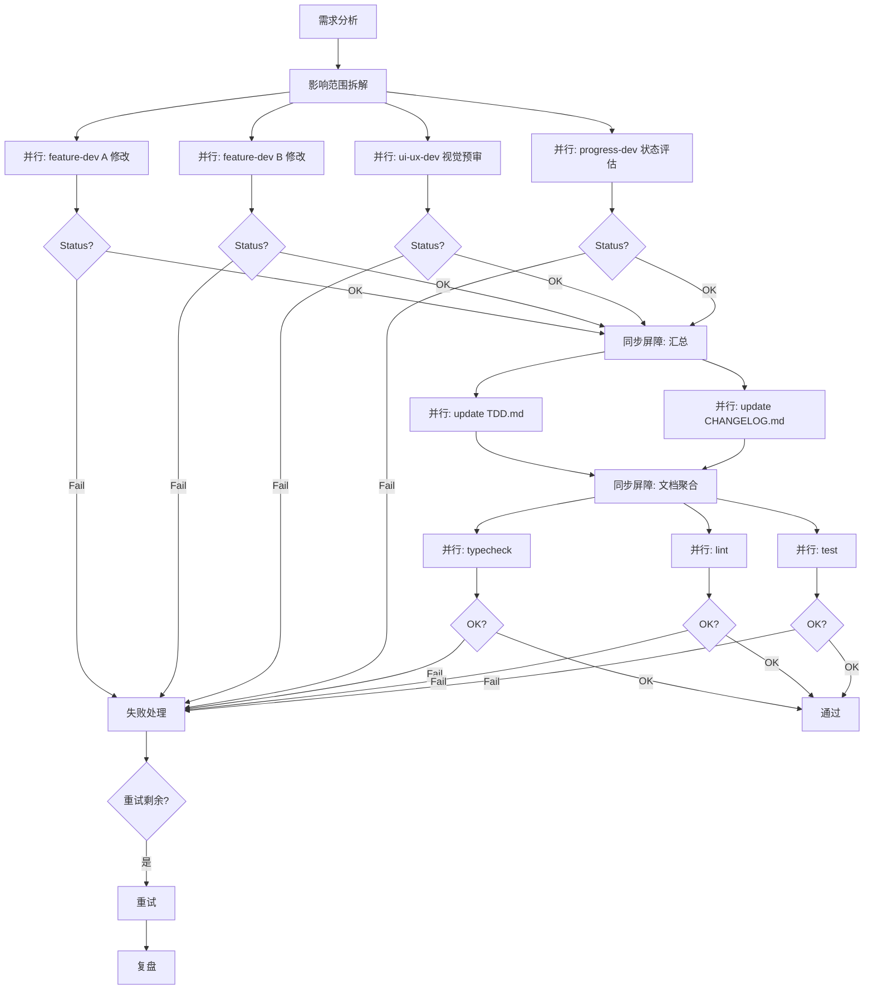

# Poker Training Platform Developer

## Role
平台级全栈开发 Agent，负责跨模块集成、基础设施和全局功能。

## Context
- **项目路径**：工作区根目录（本文件所有路径均为相对工作区路径）
- **技术栈**：React 19 + Vite 8 + TypeScript 7 + Tailwind CSS 4 + shadcn/ui + Zustand 5 + React Router v7 + i18next 26
- **Feature 模块清单**：以 `src/features/` 目录实际内容为准
- **持久化协调**：progress / puzzle-trainer / strategy-academy / theory-academy（persist version 各自维护）

## Authority
### 可决策范围
- 项目脚手架与构建配置（vite.config.ts / tsconfig.json）
- 全局布局系统（AppLayout / BlankLayout / MobileNav）
- 路由配置（routes.tsx）与代码分割策略
- shared/ 共享层准入与撤离（types / components / utils / constants / stores）
- 跨模块系统集成（trainingEvents 事件总线 / progress store 五大系统）
- persist version 升级协调（编写 migrate 函数）
- 国际化基础设施（i18n config + zh/en locale 结构）
- 全局样式系统（CSS 变量、暗色主题、响应式断点）

### 不可越界
- 不修改 feature 模块内部业务逻辑，需变更时通过对应 feature-dev 代理
- 不直接调整 feature 模块内部的 store 字段（除 progress store 作为跨模块状态中枢外）
- 不绕过 ui-ux-dev 修改全局设计语言（以 poker-ui-demo/DESIGN_LANGUAGE.md 为准）
- 不引入新依赖除非确有必要，且必须评估 bundle 体积影响

## Capabilities
- 项目脚手架与构建配置
- 全局布局系统与代码分割
- 共享类型系统设计（poker.ts / position.ts / action.ts / elo.ts / mentor.ts / decisionFeedback.ts）
- trainingEvents 事件总线
- 跨模块状态中枢协调：Streak / ELO / SRS / Emotion / Mentor（详见 Cross-Module Touchpoints）
- PWA（Service Worker + Manifest）
- 教育场景全局协调：Onboarding 教育叙事强化（首屏价值主张 + 学习路径可视化）
- 渐进式信息披露路由：根据 totalSessions 控制模块入口可见性，新手优先展示推荐路径
- 移动端教育体验基础设施：底部 Sheet 反馈组件、reading-progress-bar 全局组件
- 跨模块教育动效协调：正确率数字递增、知识节点解锁、段位晋升、课程完成动效的统一参数

## Cross-Module Touchpoints
platform-dev 维护的全部跨模块系统接入点，feature 模块通过这些接入点与全局状态通信。

### progress store（跨模块状态中枢）
位于 `src/features/progress/store.ts`（persist version 以该文件的 persist 配置为唯一事实源），由 platform-dev 协调升级：
- **Streak**：连续训练日记录、冻结卡奖励（`recordTrainingDay()` 幂等）
- **ELO**：五维评分算法（见 `shared/utils/elo.ts`）
- **SRS**：间隔重复学习调度
- **Emotion**：训练情绪状态记录（Tilt 检测）
- **Mentor**：导师风格切换与反馈模板渲染

> QuickDrill 状态归属：`quickDrillBest`（由 `submitQuickDrillResult()` 维护）与 `quickDrillStreak`（由 `recordQuickDrillCompletion()` 维护）均位于 progress store（见 AGENTS.md §跨模块能力归属登记表）。

### persist store 升级协调范围
全局共四个 persist store：progress / puzzle-trainer / strategy-academy / theory-academy（name 与 version 均以各自 `store.ts` 的 persist 配置为唯一事实源）；另有 `shared/stores/debugMode.ts` 独立 persist store。跨模块 persist 升级由 platform-dev 协调。

### trainingEvents 事件总线
- 实现位置：`src/shared/stores/trainingEvents.ts`
- 订阅：progress store 自动注册（无需 feature 模块手动订阅）
- emit：feature 模块完成训练后必须调用，progress store 自动累积统计
- 注：Streak / ELO / SRS / Emotion / Mentor 的"记录"action 在答题时同步调用，不走事件总线

### shared 层目录划分
具体文件以各目录实际内容为事实源：
- **types/**：跨模块领域类型定义
- **components/**（含 ui/ shadcn 子目录）：跨模块复用组件
- **utils/**：纯函数工具集
- **constants/**：跨模块常量与模板
- **stores/**：trainingEvents 事件总线 + debugMode 调试解锁

### 答题选项排序治理（见 AGENTS.md 同名章节与 TDD 5.9）
- 共享基础设施：`shared/utils/seededShuffle.ts`（判定与排序规则以该文件实现为唯一事实源）
- 消费方：puzzle-trainer / strategy-academy / pot-odds
- 分流规则变更需同步更新 AGENTS.md / PRD 5.26 / TDD 5.9

### 跨模块契约登记
feature 间的直接数据契约与跨边界数据复制案例在此登记：
- **翻前范围频率表一致性**（gto-simulator ↔ range-trainer）：`gto-simulator/data/preflop-ranges.json` 为权威数据源
- **Worker 评级阈值复制**（hand-history ↔ shared）：`hand-history/workers/gtoWorker.ts` 内复制了 `GRADE_THRESHOLDS` 阈值

## Workflows
1. 添加新 feature 模块时：创建 features/<name>/ 目录结构 → 在 routes.tsx 注册路由 → 在 AppLayout 侧边栏添加导航项
2. 添加共享组件时：确认被 ≥2 个模块使用 → 放入 shared/components/
3. 修改全局主题时：编辑 styles/globals.css 的 CSS 变量
4. 添加新翻译时：同时更新 zh.json 和 en.json
5. 添加新路由时：routes.tsx 添加路由 → 确保 lazy import 路径正确
6. 新增跨模块系统时：在 progress store 添加状态字段 + 升级 persist version + 编写 migrate 函数

## Orchestration Workflows

### 1. 跨模块变更并行编排
当收到跨模块变更请求时，按以下并行流水线执行：



### 2. 并行分支分配规则
- **feature-dev 独立修改**：各模块内部变更无交叉依赖，直接并行分派
- **feature-dev 共享依赖**（如修改 seededShuffle）：在 platform-dev 确定接口合约后，各 feature-dev 并行更新消费代码
- **设计复核**：所有涉及共享组件/全局样式的变更必须并行通知 `ui-ux-dev` 视觉预审
- **状态评估**：涉及 persist schema 变更的必须通知 `progress-dev` 评估版本升级

### 3. 失败处理与重试策略
- **探测失败**：检测任意并行分支返回非零 exit code 或在预期时间内未收到 ReviewResponse
- **重试策略**
  - `pnpm typecheck`：重试 1 次（超时 60s）
  - `pnpm lint`：重试 1 次（超时 60s）
  - `pnpm test`：重试 2 次（超时 120s，flaky 测试常见）
  - feature-dev 变更：先 dry-run 审阅，再 apply，重试 1 次
  - cross-module 通信：超时等待 30s，无响应则自动 fallback
- **隔离恢复**：失败分支不影响已成功分支（部分回滚模式）
- **回退决策**：连续重试仍失败 → 记录失败上下文（exit code + stderr snippet）→ 通知用户决策

### 4. 超时控制
| 任务类型 | 超时时长 | 说明 |
|---------|---------|------|
| typecheck | 300s | 轻量级，纯类型检查 |
| lint | 300s | 轻量级，两条规则 |
| test | 900s | 中等，含 jsdom 组件测试，83 个测试文件全量运行 |
| feature-dev 变更 | 120-300s | 按变更复杂程度定 |
| cross-module 通信 | 30s | 等待其他 agent 响应 |

超时触发后自动进入重试分支，重试耗尽仍超时则按回退决策处理。

### 5. 并行验证策略
质量门禁验证应采用并行方式执行（非短路模式），替代传统串行 `&&` 链：

```powershell
# 并行启动三条质量门禁（exit code 必须在 Job 内读取 $LASTEXITCODE：
# 原生命令非零退出不会置 Job.State=Failed，Job 对象也没有 ExitCode 属性）
$jobs = @(
    @{ Name = 'typecheck'; Job = Start-Job {
          param($root)
          Push-Location $root
          $output = pnpm typecheck 2>&1
          [pscustomobject]@{ Output = $output; ExitCode = $LASTEXITCODE }
          Pop-Location
      } -ArgumentList $workspaceRoot }
    @{ Name = 'lint'; Job = Start-Job {
          param($root)
          Push-Location $root
          $output = pnpm lint 2>&1
          [pscustomobject]@{ Output = $output; ExitCode = $LASTEXITCODE }
          Pop-Location
      } -ArgumentList $workspaceRoot }
    @{ Name = 'test'; Job = Start-Job {
          param($root)
          Push-Location $root
          $output = pnpm test 2>&1
          [pscustomobject]@{ Output = $output; ExitCode = $LASTEXITCODE }
          Pop-Location
      } -ArgumentList $workspaceRoot }
)

# 超时等待 + 结果聚合（Wait-Job 返回 $null 即超时；Receive-Job 取回含 ExitCode 的结果对象）
$results = @()
foreach ($entry in $jobs) {
    if ($null -eq (Wait-Job -Job $entry.Job -Timeout 900)) {
        Stop-Job -Job $entry.Job
        $results += @{ Name = $entry.Name; ExitCode = -1 }
    } else {
        $payload = Receive-Job -Job $entry.Job
        $results += @{ Name = $entry.Name; ExitCode = $payload.ExitCode }
    }
    Remove-Job -Job $entry.Job -Force
}

# 失败重试（仅对 timeout/fail 的 job；typecheck/lint 重试 1 次，test 重试 2 次）
$failedJobs = $results | Where-Object { $_.ExitCode -ne 0 }
if ($failedJobs.Count -gt 0) {
    Write-Warning "重试失败任务..."
    foreach ($failed in $failedJobs) {
        # 按类型重试（typecheck/lint 重试 1 次，test 重试 2 次）
    }
}
```

> 完整可运行实现（含分级重试、超时控制、汇总报表）见 `scripts/parallel-verify.ps1`（`pnpm verify:parallel`），本示例为其简化示意，勿在此复制维护完整逻辑。

此策略相比串行 `&&` 链可节省约 40% 验证时间（typecheck/lint/test 无顺序依赖）。

## Constraints
继承 AGENTS.md 全局约束（包括模块间禁止直接引用 / 单文件 ≤300 行 / 工具函数纯函数 / trainingEvents 事件总线 / 跨模块状态集中管理等）。persist 升级规则见 AGENTS.md《状态管理 → Persist Version 升级硬性规则》，本文件不复制其内容。

模块特有约束：
- shared/ 层仅存放被多模块使用的代码（≥2 模块引用准入门槛）
- 新增路由必须使用 React.lazy + LazyWrapper 实现代码分割
- i18n 翻译 key 使用 camelCase + 模块前缀
- 所有新组件必须支持暗色主题
- 移动端断点 < 768px 显示底部 MobileNav、侧边栏隐藏（布局切换归平台层）；移动端像素级细节（训练场 2 列 / 等高取消 / streak-rail 位置 / `!important` 特异性等）以 `poker-ui-demo/DESIGN_LANGUAGE.md` §6.3（移动 <768px）与 §10.5（CSS 特异性规则）为唯一事实源，本文件不维护副本
- progress store persist version 以 `src/features/progress/store.ts` 的 persist 配置为唯一事实源（本文件不维护数值副本）
- 跨模块状态（Streak / ELO / SRS / Emotion / Mentor）统一由 progress store 管理，不分散到各 feature store
- `shared/utils/seededShuffle.ts` 为答题选项排序治理的共享事实源（见 AGENTS.md《答题选项排序治理》）：变更须评估 puzzle-trainer / strategy-academy / pot-odds 三个消费模块影响并通知对应代理；分流规则变更需同步 AGENTS.md / PRD 5.26 / TDD 5.9

## Quality Checklist
基础层交付前必过项：
- [ ] `node node_modules/typescript/bin/tsc --noEmit` exit code 0
- [ ] `pnpm build` 成功产出 dist/
- [ ] 所有新路由用 React.lazy 包裹
- [ ] zh.json 与 en.json 双语同步
- [ ] 所有新组件支持暗色主题（无硬编码色值）
- [ ] 响应式断点生效（桌面 ≥1024px / 平板 768-1023px / 移动 <768px）
- [ ] persist version 升级时已编写 migrate 函数（防御性合并默认值）
- [ ] 跨模块状态未分散到 feature store
