## 用户需求

基于已完成的桌面端/平板端可访问性与 UI 质量评审报告（`desktop-tablet-audit.md`），产出一份**包含子代理协作机制的完整修复方案文档**，覆盖全部 25 项问题（P0×1 / P1×6 / P2×10 / P3×8，含 3 项仅复核归档项）。

## 澄清确认

- 修复范围：全部 P0-P3，一次覆盖所有发现项（含触控目标微调等细节）。
- 协作机制：按职责串行交接——逐个责任智能体顺序修复，每阶段由 platform-dev 复核通过后才进入下一模块。
- 执行方式：本轮仅输出可执行修复方案文档（含协作机制），不实际改代码。

## 交付物

一份可执行修复方案文档（工作区根目录 `desktop-tablet-fix-plan.md`，与 `desktop-tablet-audit.md` / `mobile-accessibility-audit.md` 同约定），内容须包含：

1. 全部 25 项问题的完整修复清单：每项含问题定位（文件:行号）、技术修复方案、涉及 i18n 双语 key、责任智能体、复核要点。
2. 串行交接的子代理协作机制：阶段划分顺序、交接单模板、platform-dev 复核门禁（typecheck/lint/test + 视觉抽查）、交接顺序依据。
3. 回归验证与文档同步要求（AGENTS.md / CHANGELOG / TDD 触发条件、Feature PR Checklist）。

## 技术栈选择

- 方案文档为纯 markdown（无新依赖），修复实施沿用现有技术栈：React 19 + TypeScript 7 + Tailwind CSS 4 + i18next + Service Worker。
- 字体自托管：三款字体（Fraunces / Inter Tight / JetBrains Mono）woff2 放入 `public/fonts/`，`globals.css` 加 `@font-face` + `font-display: swap`，移除 `index.html:15` 的 Google Fonts `<link>`；无新依赖。

## 实施方法（核心策略）

- **先平台、后模块、收尾复核**的串行交接链：platform-dev 先行定全局策略（G1 限宽策略 / G2 键盘可达性共享方案 / 字体自托管），各模块 agent 按 P0→P3 顺序接入，ui-ux-dev 视觉复核收尾，platform-dev 全量回归 + 文档同步。
- **G1 全局 max-w 双轨制**：`AppLayout.tsx:324` main 内层包 `mx-auto w-full max-w-[1400px]`；操作台/统计页随全局限宽，阅读型页面（TheoryChapterView / CourseView / HelpArticle）正文单独 `max-w-3xl mx-auto`（保留导航/按钮全宽）。先由 platform-dev 定策略避免各模块重复返工。
- **G2 键盘可达性统一方案**：RangeGrid / StrategyMatrix / ConceptGraph 三处同型反模式，统一补 `role="button"` + `tabIndex={0}` + `onKeyDown`(Enter/Space)；抽共享 hook（如 `shared/utils/useGridKeyboardNav.ts` 或 hooks 目录）满足 shared 层 ≥2 模块准入门槛（恰好三处消费方），由 platform-dev 落定方案，各模块 agent 接入。
- **H-H1 删除按钮（P0）**：去掉 `opacity-0 group-hover:opacity-100`，改常显弱化态（`text-[var(--ivory-muted)]/70 hover:text-[var(--clay)]`），触屏/平板可直接点按；补 aria-label。
- **字体自托管 + SW**：`sw.js` 当前仅对 `assets/` 前缀做 cache-first，字体落 `public/` 根路径将走 network-first 无缓存分支；需在 `sw.js` 增加 `url.pathname.startsWith(BASE + 'fonts/')` 的 cache-first 分支，保证离线可用与缓存效率。
- **P-S1 音效 toggle**：`SettingsPage.tsx:275-287` 改 `role="switch"` + `aria-checked` + 双语 `aria-label`（替代现有 `aria-pressed`）。

## 实施注意（防回归）

- i18n：所有新增 aria-label/可见文本须 zh/en 双语同步，key 命名 `<module>.<context>.<field>`（如 `handHistory.replay.prevStreet`、`progress.settings.soundSwitch`）。
- 硬约束：单文件 ≤300 行、模块间禁止直接引用、shared 准入门槛 ≥2、颜色仅走四层 token（禁硬编码 hex，ErrorBoundary 内联 fallback 属 P3 收尾项）。
- 本方案预计不涉及 persist schema 变更，无需 version 递增/migrate；若执行中发现例外由 platform-dev 协调。
- 每次代码变更后必须 `pnpm verify`（typecheck + lint + test）；SW 变更后手动验证离线字体缓存生效。
- 已满足归档项（P-S3 语言切换冗余提示、O-O2 图表固定高、S-S4/S-S5/U-U3/T-T2/C-C1 响应式基准）不产生代码改动，仅归档说明。

## 架构设计（子代理串行交接机制）

```mermaid
flowchart LR
    P0[阶段0 platform-dev<br>G1 全局max-w策略 / 字体自托管+SW / G2 键盘可达性共享方案] --> P1[阶段1 hand-history-dev<br>H-H1 P0 / H-H4 / H-H5 / H-H2 / H-H6 / H-H3]
    P1 --> P2[阶段2 progress-dev<br>P-S1 / P-S2 / P-M1 / P-M2 / P-D1 / P-L1]
    P2 --> P3[阶段3 range-trainer-dev<br>R-R1 接入G2 / R-R2 / R-R3 / R-R4]
    P3 --> P4[阶段4 gto-simulator-dev<br>G-G3 接入G2 / G-G1 / G-G2]
    P4 --> P5[阶段5 pot-odds-dev<br>O-O3 / O-O1]
    P5 --> P6[阶段6 strategy-academy-dev<br>S-S1 接入G2 / S-S2 / S-S3 / S-S6]
    P6 --> P7[阶段7 theory-academy-dev<br>T-T1]
    P7 --> P8[阶段8 puzzle-trainer-dev<br>U-U2 / U-U1]
    P8 --> P9[阶段9 help-center-dev<br>C-C2]
    P9 --> P10[阶段10 ui-ux-dev<br>视觉一致性复核 + ui-visual-validator]
    P10 --> P11[阶段11 platform-dev<br>全量回归 pnpm verify + 文档同步]
```



- 交接顺序依据：P0 功能性缺陷优先（hand-history 最先）；平台层策略（G1/G2/字体）先行避免各模块重复实现；理论/帮助等低风险模块后置；ui-ux-dev 统一视觉复核；platform-dev 收尾回归与文档同步。
- 每阶段交接门禁：模块 agent 输出**交接单**（完成项 / 验证结果 / 遗留风险 / 待复核点）→ platform-dev 复核 `pnpm verify` 全绿 + 关键交互人工抽查 → 才进入下一阶段。

## 目录结构

```
dezhou/
├── desktop-tablet-fix-plan.md   # [NEW] 本轮交付：完整修复方案文档（25 项清单 + 串行协作机制 + 回归验证要求）
└── src/                         # [后续执行阶段涉及，本轮不改] 修改文件清单（详见文档 §四）：
    ├── layouts/AppLayout.tsx                     # [MODIFY] G1 main 内层 max-w-[1400px]
    ├── shared/utils/useGridKeyboardNav.ts        # [NEW] G2 共享键盘导航 hook（≥2 模块门槛达标）
    ├── features/hand-history/components/
    │   ├── HandHistoryList.tsx                   # [MODIFY] H-H1 P0 删除按钮常显 + H-H2 flex-wrap + H-H3 max-w
    │   ├── HandImporter.tsx                      # [MODIFY] H-H4 拖拽区键盘可达
    │   └── HandReplayer.tsx                      # [MODIFY] H-H5 aria-label + H-H6 布局响应式
    ├── features/progress/components/
    │   ├── settings/SettingsPage.tsx             # [MODIFY] P-S1 role=switch + P-S2 flex-wrap
    │   ├── stats/ModuleStatsPage.tsx             # [MODIFY] P-M1 aria-label + P-M2 grid-cols-2 md:3
    │   ├── achievement/Leaderboard.tsx           # [MODIFY] P-L1 flex-wrap
    │   └── dashboard/Dashboard.tsx               # [MODIFY] P-D1 随 G1 限宽
    ├── features/range-trainer/components/
    │   ├── RangeGrid.tsx                         # [MODIFY] R-R1 键盘可达 + R-R2 响应式列
    │   └── RangeSelector.tsx                     # [MODIFY] R-R3 触控区 + R-R4 锁定可见文本
    ├── features/gto-simulator/components/
    │   ├── StrategyMatrix.tsx                    # [MODIFY] G-G3 键盘可达
    │   ├── ScenarioSetup.tsx                     # [MODIFY] G-G1 玩家人数 flex-wrap
    │   └── GTOSessionPage.tsx                    # [MODIFY] G-G2 max-w-2xl
    ├── features/pot-odds/components/
    │   ├── PotOddsQuizPage.tsx                   # [MODIFY] O-O3 grid-cols-1 sm:3
    │   ├── OddsCalculator.tsx                    # [MODIFY] O-O1 Reset 触控区
    │   └── EVCalculator.tsx                      # [MODIFY] O-O1 Reset 触控区
    ├── features/strategy-academy/components/
    │   ├── ConceptGraph.tsx                      # [MODIFY] S-S1 SVG 节点键盘可达
    │   ├── ConceptGraphView.tsx                  # [MODIFY] S-S2 grid-cols-1 sm:3
    │   ├── CourseView.tsx                        # [MODIFY] S-S3 正文 max-w-3xl
    │   └── QuickDrill.tsx                        # [MODIFY] S-S6 flex-wrap + 响应式列
    ├── features/theory-academy/components/TheoryChapterView.tsx  # [MODIFY] T-T1 正文 max-w-3xl
    ├── features/puzzle-trainer/components/
    │   ├── PuzzleHome.tsx                        # [MODIFY] U-U1 按钮触控区
    │   └── PuzzleCard.tsx                        # [MODIFY] U-U2 sm:2 lg:3
    ├── features/help-center/components/HelpArticle.tsx          # [MODIFY] C-C2 正文 max-w-3xl
    ├── shared/components/feedback/ErrorBoundary.tsx             # [MODIFY] E-B 内联 hex 改 CSS 类
    ├── public/fonts/                             # [NEW] 三款自托管 woff2
    ├── public/sw.js                              # [MODIFY] fonts/ cache-first 分支
    ├── index.html                                # [MODIFY] 移除 Google Fonts link
    └── i18n/locales/{zh,en}.json                 # [MODIFY] 新增 aria-label 双语 key
```

## 关键代码结构（仅契约级描述）

- 交接单模板（每阶段必填）：`完成项（问题ID+文件） | 验证结果（pnpm verify 输出摘要） | 遗留风险 | 待复核点`。
- 共享键盘导航 hook 签名（供 G2 三处接入）：接收 `onSelect(value)` 与 `disabled`，返回 `{ role, tabIndex, onKeyDown }` 属性对象；Enter/Space 触发选择，禁止滚动干扰。
- 复核门禁：`pnpm typecheck` exit 0 → `pnpm lint` exit 0 → `pnpm test` exit 0（含 i18n 双语对称、designTokenGuard、axe 冒烟）；ui-ux-dev 用 ui-visual-validator 对平板 768px / 桌面 1440px 两档截图抽查。

## 智能体扩展

### SubAgent

- **code-explorer**
- 用途：编写方案文档时核对 25 项问题引用的文件:行号与代码事实准确性，防止方案与代码漂移。
- 预期产出：全量引用核对清单，标注需修正的路径/行号差异。
- **ui-visual-validator**
- 用途：方案文档中约定的"阶段10 视觉复核门禁"执行方，对平板/桌面两档视口做视觉回归抽查。
- 预期产出：截图级视觉验证报告，确认修复后无挤压/截断/品牌漂移。

### Skill

- **wcag-audit-patterns**
- 用途：校准 P1 键盘可达性（role/tabIndex/onKeyDown）与 aria 语义修复方案（switch/aria-label）的 WCAG 2.2 合规准则。
- 预期产出：G2/H-H4/H-H5/P-S1 四项 a11y 修复的合规要点清单，写入方案文档 §三。