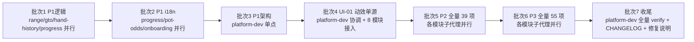

## 用户需求

依据 `docs/analysis/code-review-report.md` 全项目代码评审报告（109 项问题），制定**完整修复计划**。用户明确要求**包含可选部分**——P3 级 55 项全部纳入执行范围，不做裁剪。即 109 项（P1×15 / P2×39 / P3×55）一次性全覆盖。

## 核心内容

- **修复范围**：全部 109 项问题，无裁剪
- **批次组织**：批内并行、批间串行；每批委派对应 feature-dev 子代理修复本模块问题，跨模块问题由 platform-dev 协调
- **回归门禁**：每批修复后 `pnpm verify`（typecheck + lint + test）全绿才进入下一批
- **交付物**：各模块修复代码 + `docs/CHANGELOG.md` 追加修复批次记录 + 修复验证说明（含针对性单测补充）

## 补充约束

- 单文件 ≤300 行；TS strict + noUncheckedIndexedAccess；禁 any
- i18n 双语对称（zh/en 同步，localeParity 守卫）；designTokenGuard 反霓虹守卫
- 模块间禁止直接引用（eslint no-restricted-imports）；calculateGrade 唯一评级；seededShuffle 选项排序
- persist version 变更需 migrate 函数；颜色仅走四层 token
- 提交粒度：逻辑单元独立 commit，`type(scope)` 格式；演进历史记 `docs/CHANGELOG.md`

## 技术栈

现有项目技术栈（不引入新依赖）：React 19 + TypeScript 7(strict) + Zustand 5(persist) + i18next 26 + Tailwind CSS 4 + framer-motion 12 + IndexedDB。修复沿用既有子代理架构（`.claude/agents/` 的 `<feature-dir>-dev`）与质量门禁工具链（`pnpm verify`）。

## 实施方法（核心策略）

### 批次划分总览（批内并行、批间串行）

| 批次 | 内容 | 责任子代理 | 验证门禁 |
| --- | --- | --- | --- |
| 批次1 · P1 逻辑 | RNG-01、GTO-01/02、HH-01/02/03、PROG-08/09 | range/gto/hand-history/progress 四模块并行 | 针对性单测 + `pnpm verify` |
| 批次2 · P1 i18n | PROG-01/02、ODDS-01、OB-01 | progress/pot-odds/onboarding 三模块并行 | localeParity + `pnpm verify` |
| 批次3 · P1 架构 | PLAT-01/02/04/05 | platform-dev 单点 | eslint 守卫 + `pnpm verify` |
| 批次4 · UI-01 动效 | 43 处内联 transition（20+ 文件跨 8 模块） | platform-dev 协调 + 各模块子代理接入 | grep 断言零内联 + `pnpm verify` |
| 批次5 · P2 全量 | 39 项 P2 | 各模块子代理并行 | 单测 + `pnpm verify` |
| 批次6 · P3 全量 | 55 项 P3 | 各模块子代理并行 | `pnpm verify` |
| 批次7 · 收尾 | 全量回归 + CHANGELOG + 修复说明 | platform-dev | `pnpm verify` 全绿 |


### P1 级核心修复方案（已核实代码事实）

1. **RNG-01**（questionGenerator.ts#L94-114）：范围内题目 `correctAction` 按 `actionType` 判定——`actionType.includes('call') ? 'call' : 'raise'`，保留超时恒判错语义；同步清理 QuizCard 中 `correctAction==='call'` 死代码分支；补 `bb-call-vs-btn` 生成单测。
2. **GTO-01**（store.ts#L160-181）：`nextScenario` rescue 分支 `set` 中补 `currentIndex: session.scenarios.length`（追加前长度即新场景下标），消除决策绑定错误与进度错乱。
3. **GTO-02**（store.ts#L225-238）：`computeCallAmount` 按 node 实际 board 重新 `classifyBoardTexture`；`export` 该函数供 GTOSessionPage 复用，删除固定 0.5 写死。
4. **HH-01**（gtoDeviation.ts#L272-288）：`getDeviationSummary` 改判 `grade === 'best'`（与 shared 五级一致），补单测断言最优率非恒 0。
5. **HH-02**（gtoDeviation.ts#L126-166）：`getWorker()` 增加 `onerror` 监听重建 + `sendToWorker` resolve 时 clearTimeout + 提供卸载 terminate 时机。
6. **HH-03**（store.ts#L249-265）：`deleteHand`/`clearAll` 调用 `clearDeviationCache()`。
7. **PROG-08**（store.ts#L489-530）：`resetElo`/`syncEloFromAcademyAbility` 同步更新 `eloByVariant.standard`，消除与 `elo` 字段漂移。
8. **PROG-09**（store.ts#L441-458 + streakCalc）：`checkNewMilestone` 返回全部新达成天数数组，逐个标记并累计奖励，补跳档单测。
9. **PLAT-01**（trainingEvents.ts#L1）：`TrainingRecord` 类型下沉至 `shared/types/training.ts`，trainingEvents 引用共享类型，progress 经共享类型实现。
10. **PLAT-02**（GameVariantSelector.tsx#L5）：改为 props 注入 `currentVariant`/`setGameVariant`，解除对 progress store 的直接依赖。
11. **PLAT-04/05**：删除 `VariantRuleBanner.tsx` 与 `utils/variantRules.ts` 死代码（先 grep 确认零引用）。
12. **UI-01**：43 处内联 transition 统一替换为 `motion.ts` 预设（`transitionStandard/Slow/Fast/Spring`、`SLIDE_UP/SCALE_IN/FADE_IN` 等）；时长超上限（1.2s）改 `RESULT_NUMBER`；ease 'linear'/'easeOut' 映射 `MOTION_EASE`；循环动效走 globals.css keyframes。

### i18n 修复模式（批次 2/5/6 通用）

- UI 文案 → `t('module.context.field')`，zh/en.json 对称补 key（localeParity 守卫验证）。
- 题库/数据层文案 → 数据存 i18n key 或组件内 `t(key, { defaultValue: 数据层原文 })`（沿用 strategy-academy `titleKeys.ts` 既有模式）。
- 孤儿 key 检查：`search_content` 确认新 key 有消费方。
- Canvas 文本（shareCard）→ i18n 取翻译字符串后 fillText。

### 架构修复顺序（批次 3，platform-dev 单点）

PLAT-01（类型下沉）→ PLAT-02（props 解耦）→ PLAT-04/05（死代码删除）→ 全量 `pnpm verify`；涉及 eslint `ALLOWED_CROSS_IMPORTS` 白名单变更时同步更新并跑 `eslintCrossImports` 测试。

### P2/P3 执行策略（批次 5/6）

按模块并行委派子代理，遵循各模块既有审查重点（详见评审报告 §3 各节交接单），每项修复按"ORIGINAL/NEW 代码对"落地；P3 项含 a11y 修复（PositionBadge/aria）、守卫增强（designTokenGuard 覆盖 CSS/霓虹 hex/rgba）、测试健壮性（HelpHome 选择器）等，全部执行不裁剪。

### 实施注意（防回归）

- **性能**：批次 4 动效替换不得引入额外重渲染；HH-06 IndexedDB 分页评估惰性 cursor 方案。
- **日志**：无新增日志需求；Worker 错误监听仅 console.error 不 dump payload。
- **爆炸半径**：PLAT 系列变更涉及 shared 层，须全量 verify 覆盖所有订阅方；persist 相关（PROG-08/09）若改 schema 须递增 version 并写 migrate。
- **回归验证**：每批后 `pnpm verify`；UI 视觉修复后 `designTokenGuard` + 可选 Playwright 截图。

## 架构设计（子代理协作流程）



- 批次间通过「verify 全绿」交接；每批产出交接单（完成项/验证结果/遗留风险）。
- 跨模块问题（UI-01、PLAT 系列、PLAT-08 i18n 模式）由 platform-dev 统一裁决，避免多代理写同一文件冲突。

## 目录结构（修复涉及的主要文件）

```
src/
├── shared/
│   ├── stores/trainingEvents.ts        # [MODIFY] PLAT-01 类型下沉
│   ├── types/training.ts               # [NEW] PLAT-01 TrainingRecord 共享类型
│   ├── components/business/GameVariantSelector.tsx  # [MODIFY] PLAT-02 props 解耦
│   ├── components/VariantRuleBanner.tsx             # [DELETE] PLAT-04 死代码
│   ├── utils/variantRules.ts                        # [DELETE] PLAT-05 死代码
│   ├── components/MdfComparisonTable.tsx            # [MODIFY] PLAT-06 迁移 or 留档
│   ├── components/feedback/ResultSummary.tsx        # [MODIFY] PLAT-08 i18n
│   └── utils/shareCard.ts                           # [MODIFY] PLAT-10 Canvas i18n
├── features/
│   ├── range-trainer/utils/questionGenerator.ts     # [MODIFY] RNG-01/06
│   ├── gto-simulator/store.ts                       # [MODIFY] GTO-01/02/10
│   ├── hand-history/utils/gtoDeviation.ts           # [MODIFY] HH-01/02/08
│   ├── hand-history/store.ts                        # [MODIFY] HH-03/06/09
│   ├── progress/store.ts                            # [MODIFY] PROG-08/09/10/13
│   ├── progress/utils/dailyTrainingPlan.ts          # [MODIFY] PROG-02
│   ├── progress/components/dashboard/ModuleStatsPage.tsx  # [MODIFY] PROG-01
│   ├── pot-odds/components/PotOddsQuizPage.tsx      # [MODIFY] ODDS-01/02/03/05
│   ├── onboarding/data/placementQuestions.ts        # [MODIFY] OB-01
│   ├── strategy-academy/store.ts                    # [MODIFY] ACAD-01/02/03/04/07/08
│   ├── theory-academy/ (各组件)                     # [MODIFY] THY-01~13
│   ├── puzzle-trainer/components/DailyPuzzle.tsx    # [MODIFY] PZL-01
│   ├── puzzle-trainer/hooks/usePuzzleSession.ts     # [MODIFY] PZL-02
│   └── help-center/components/HelpHero.tsx          # [MODIFY] HELP-01
├── layouts/BlankLayout.tsx                          # [MODIFY] PLAT-09 i18n
├── i18n/locales/zh.json + en.json                   # [MODIFY] 全部 i18n 修复双语 key
└── styles/globals.css                               # [MODIFY] UI-10 裸 hex 锚定
docs/CHANGELOG.md                                    # [MODIFY] 批次7 追加修复记录
```

## Agent Extensions

### SubAgent

- **code-explorer**
- 用途：作为各批次修复执行主体（对应各 feature-dev 子代理），逐模块定位并修复本模块问题清单中的 P1/P2/P3 项。
- 预期产出：每批各模块修复完成 + 交接单（完成项/验证结果/遗留风险），批次内全部模块交接后统一 `pnpm verify` 回归。
- **ui-visual-validator**
- 用途：批次 4（UI-01 动效单源）与批次 5/6 中涉及视觉的问题（UI-02~07、RNG-02、PROG-07 等）修复后，做截图级视觉/响应式回归验证。
- 预期产出：视觉验证报告，确认动效替换与配色 token 化无视觉回归。

### Skill

- **lsp-code-analysis**
- 用途：PLAT 系列架构修复（类型下沉、死代码删除确认、调用链核查）与 UI-01 动效替换时进行语义级代码导航，确认引用方与爆炸半径。
- 预期产出：符号引用与调用链清单，支撑死代码删除安全性与跨模块影响判定。
- **wcag-audit-patterns**
- 用途：校准批次 6 中 a11y 类 P3 修复（UI-09 PositionBadge、ODDS-06、HELP-03、ACAD-06 aria）的 WCAG 2.2 合规准则。
- 预期产出：a11y 修复要点清单，确保 aria/对比度/键盘可达达标。