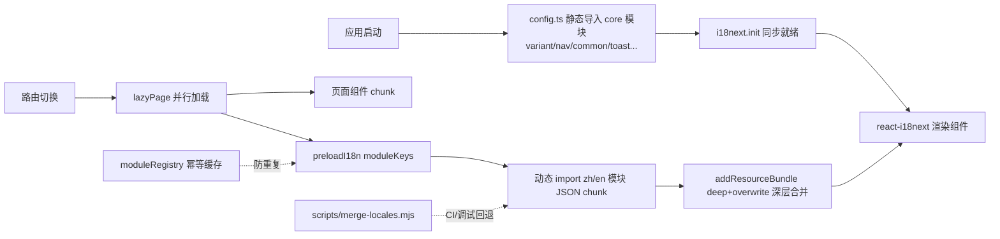

## 产品概述

将当前单一、超大的双语翻译文件（zh.json / en.json，各约 3000+ 行）拆分为按模块组织的独立文件，在完全保持现有 i18next 国际化框架与调用方式兼容的前提下，实现"启动仅加载核心、功能模块按需加载"的按需翻译加载机制，降低维护成本与首屏资源体积。

## 核心特性

- **模块化拆分**：按现有 41 个顶层命名空间 key（variant、nav、rangeTrainer、potOdds、gto、theory、handHistory、puzzle、academy、help 等）将 zh/en 各拆为独立小文件，每个文件对应唯一顶层 key，天然消除命名空间冲突
- **调用零改动**：维持单一 `translation` 命名空间与 `t('nav.overview')` 路径式调用不变，全项目 150+ 处 `useTranslation()` 组件无需任何修改
- **按路由懒加载**：应用启动仅同步加载布局/导航/公共反馈等核心模块（core），各功能模块翻译随页面路由（React.lazy）并行动态加载，避免一次性加载全部内容
- **合并策略**：利用 i18next 原生 `addResourceBundle(lng, ns, resources, deep, overwrite)` 完成嵌套结构深层合并与覆盖，模块内保持原有嵌套层级（如 `rangeTrainer.rangeSelect.title`）
- **健壮性保障**：加载幂等（防重复请求）、失败兜底（t 回退 key / 默认中文）、双语键对称守卫与模块完整性校验由自动化测试持续保障

## 技术选型

- **国际化**：沿用现有 i18next ^26.3.6 + react-i18next（`addResourceBundle` 原生支持深层合并与覆盖，零新依赖，符合 AGENTS.md 禁新依赖约束）
- **按需加载**：Vite 动态 `import()`（JSON 自动生成带 content-hash 的独立 chunk，与现有 sw.js 版本缓存机制天然兼容，无需改动 `vite.config.ts` manualChunks）
- **构建辅助**：Node 内置 fs/path 编写一次性拆分脚本（无第三方依赖），仅用于迁移与 CI/调试合并回退，不作为运行时主路径

## 实现方案

采用"**顶层 key 即文件、core 同步 + 功能模块路由懒加载**"策略：

1. **拆分**：运行 `scripts/split-locales.mjs`，将 zh.json / en.json 按 41 个顶层 key 拆分为 `src/i18n/locales/{zh,en}/<key>.json`（共 82 个小文件），拆分后删除原大文件；脚本同时做完整性校验（各文件顶层 key 唯一、无遗漏）
2. **注册表**：`moduleRegistry.ts` 定义 `I18nModuleKey` 联合类型、core 模块清单、每语言 `() => import('./locales/zh/rangeTrainer.json')` 式显式加载器（类型安全、tree-shakable、便于按 feature 聚合分组）
3. **运行时组合**：`preload.ts` 提供 `preloadI18n(lng, keys)` 幂等函数——内部维护已加载集合防重复；对每个 key 动态 import 对应语言 JSON，再 `addResourceBundle(lng, 'translation', { [key]: data }, true, true)` 深层合并注入；`config.ts` 改造为同步静态导入 core 模块（启动就绪、无竞态闪烁），功能模块全部走 preload
4. **路由接入**：`routes.tsx` 引入 `lazyPage(loader, i18nKeys)` 辅助（对现有 `lazy(() => import(...))` 做机械替换），页面组件 chunk 与该页所需翻译 chunk 通过 `Promise.all` 并行加载；以 feature→module 分组映射（如 `/progress` 页 → progress/dashboard/elo/rankUp/streak 等一组）减少请求次数
5. **构建/调试回退**：`scripts/merge-locales.mjs` 支持将拆分文件重建为合并 JSON，供 CI 对照与调试使用（非运行时路径）

## 实施注意

- **性能**：启动 bundle 仅含 core（约 10 个顶层 key，其余 2200+ 行延迟加载）；preload 幂等缓存避免重复动态 import 与重复 addResourceBundle
- **兼容性**：动态 chunk 带 hash，确认 `public/sw.js` 的运行时缓存策略能缓存动态请求的 i18n chunk（如为 precache-only 则需在实现时纳入）；`fallbackLng: 'zh'` 保留，单语言加载失败时回退默认中文
- **测试影响**：`localeParity.test.ts` 改为按模块文件扫描做双语键对称（守卫更精确、按模块报告差异）；`drillOptionOrder.test.ts` 改为导入 `locales/zh/drills.json` 等拆分文件；新增 preload 幂等/深层合并/注册表完整性测试
- **文档同步**：`docs/AI_GUIDE.md` i18n 章节、`docs/CHANGELOG.md` 版本演进、`AGENTS.md` 目录结构注释（`src/i18n/` 现为 config + 双层 locales 目录）须同步更新，遵循三层职责分离与"以代码为唯一事实源"原则

## 架构设计



## 目录结构

```
src/i18n/
├── config.ts                 # [MODIFY] 改造：静态导入 core 模块后 init；导出 i18n 不变
├── moduleRegistry.ts         # [NEW] I18nModuleKey 联合类型 / core 清单 / 每语言动态加载器 / feature 分组映射
├── preload.ts                # [NEW] preloadI18n(lng, keys) 幂等懒加载：去重缓存 + addResourceBundle 深层合并注入
├── localeParity.test.ts      # [MODIFY] 改为遍历全部模块文件断言 zh/en 键对称，按模块报告缺失键
├── preload.test.ts           # [NEW] 幂等性 / 深层合并正确性 / 注册表完整性（41 key 全齐无重叠）测试
└── locales/
    ├── zh/                   # [NEW] 41 个模块文件：variant.json、app.json、nav.json、rangeTrainer.json、
    │   ...                   #       potOdds.json、gto.json、progress.json、theory.json、handHistory.json、
    │                         #       puzzle.json、academy.json、help.json、onboarding.json、common.json 等
    └── en/                   # [NEW] 与 zh/ 一一对应的 41 个模块文件
scripts/
├── split-locales.mjs         # [NEW] 一次性拆分脚本：按顶层 key 生成 82 个文件 + 完整性校验 + 删除原文件
└── merge-locales.mjs         # [NEW] 合并脚本：重建合并 JSON 供 CI/调试对照（非运行时路径）
src/app/routes.tsx            # [MODIFY] lazyPage 辅助替换全部 lazy()，按路由挂载翻译分组预加载
src/features/strategy-academy/utils/drillOptionOrder.test.ts  # [MODIFY] 改导入拆分后的 drills 模块文件
docs/AI_GUIDE.md              # [MODIFY] i18n 章节同步新结构与新增 key 流程
docs/CHANGELOG.md             # [MODIFY] 记录本次 i18n 模块化演进
AGENTS.md                     # [MODIFY] src/i18n/ 目录注释同步双层 locales 结构
```

## 关键代码结构

```ts
// moduleRegistry.ts —— 核心契约（实现时按实际 key 消费核实 core 清单）
type I18nModuleKey =
  | 'variant' | 'app' | 'nav' | 'rangeTrainer' | 'potOdds' | 'gto'
  | 'progress' | 'dashboard' | 'theory' | 'handHistory' | 'puzzle'
  | 'academy' | 'help' | 'onboarding' | 'common' | 'feedback' | 'toast'
  | 'settings' | 'leaderboard' | 'streak' | 'drills' | /* ... 共 41 项 */;

export const CORE_MODULES: readonly I18nModuleKey[] = [/* 布局/导航/全局反馈必需，如 variant/app/nav/common/toast/feedback/shortcuts/gameVariant/mentor */];
export const FEATURE_GROUPS: Record<string, readonly I18nModuleKey[]> = {
  '/range-trainer': ['rangeTrainer'],
  '/progress': ['progress', 'dashboard', 'elo', 'rankUp', 'streak', 'achievements'],
  // ...
};
export const loadModule = {
  zh: { rangeTrainer: () => import('./locales/zh/rangeTrainer.json'), /* ... */ },
  en: { rangeTrainer: () => import('./locales/en/rangeTrainer.json'), /* ... */ },
} as const;

// preload.ts —— 幂等注入（核心 API）
export async function preloadI18n(keys: readonly I18nModuleKey[]): Promise<void>;
export async function preloadFeature(group: keyof typeof FEATURE_GROUPS): Promise<void>;
```

## Agent 扩展

### SubAgent

- **code-explorer**
- 用途：核实各 feature 模块实际消费的 i18n 顶层 key，建立"路由 → 翻译模块分组"映射（FEATURE_GROUPS）与 core 模块清单，避免映射臆测
- 预期产出：经验证的 feature→key 消费矩阵与 core 清单，作为 moduleRegistry 实现的唯一数据源

### MCP

- **Context7**
- 用途：验证 i18next `addResourceBundle(lng, ns, resources, deep, overwrite)` 的深层合并/覆盖语义与初始化异步模式，确保 preload 注入方式与当前 i18next 26 API 精确匹配
- 预期产出：与安装版本一致的 API 用法确认，避免签名误用