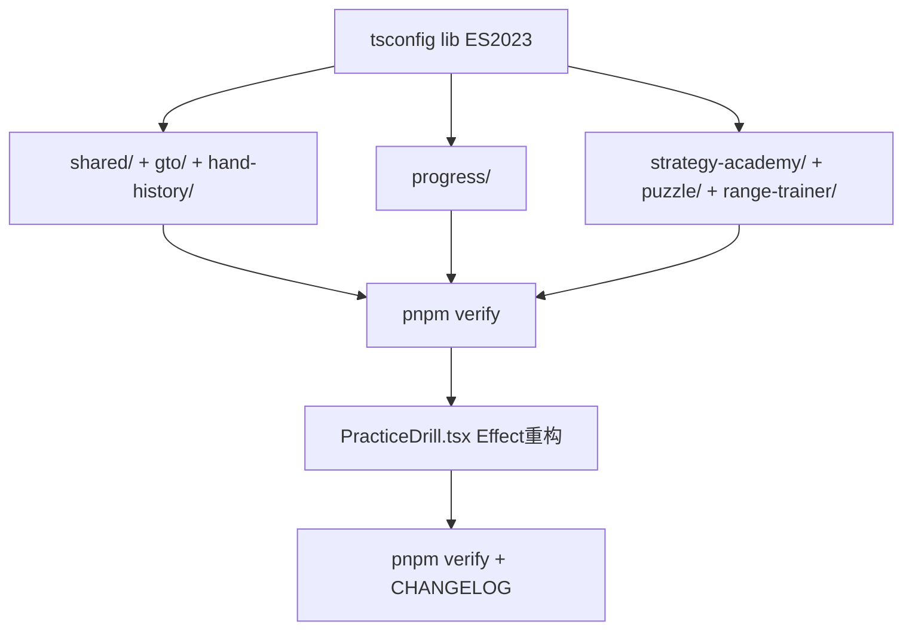

## 用户需求

基于 Vercel React Best Practices 审查结论（`react-best-practices-review.md`），对项目中违反 React 最佳实践的代码进行系统性修复。用户明确要求：细化修复步骤，并调用子代理协作机制进行并行修复。

## 产品概述

本次修复不涉及 UI 视觉变化，纯代码质量改进。修复后代码将符合 AGENTS.md §React 渲染约定中已写入的约束条款（数组不可变性、Effect 治理）。

## 核心修复项

- **P1（CRITICAL）**：26 个生产文件中 39 处 `.sort()` 原地排序替换为 `.toSorted()` 不可变排序（含 7 处源数组突变高风险项）
- **P3（MEDIUM）**：`PracticeDrill.tsx` 中 2 个可优化的 useEffect（压力模式难度 Effect 改派生值；超时处理 Effect 移到倒计时回调）
- **前置阻塞**：`tsconfig` lib 需从 ES2020 升级到 ES2023，否则 `toSorted()` 类型检查不通过
- **P2 已排除**：数值型 `&&` 条件渲染扫描结果为 0 匹配，无真实 bug，不在本次修复范围

## Tech Stack

- React 19 + TypeScript 7（strict, target ES2020）+ Vite 8
- 状态管理：Zustand 5（persist）
- 质量门禁：`pnpm verify` = typecheck + lint + test（串行短路）

## Implementation Approach

### 前置：tsconfig lib 升级（阻塞项）

当前 `tsconfig.app.json` 与 `tsconfig.json` 的 `target: ES2020` + `lib: ["ES2020", ...]` 不包含 ES2023 的 `Array.prototype.toSorted/toReversed/toSpliced` 类型定义。必须先将两个文件的 `lib` 升级为 `["ES2023", "DOM", "DOM.Iterable"]`，`target` 保持 `ES2020`（Vite/esbuild 负责降级转译，现代浏览器均原生支持 ES2023 方法）。

**决策依据**：仅升级 lib（类型定义层）不改变 target（运行时输出），对构建产物零影响，最小化变更范围。

### P1：.sort() → .toSorted() 机械替换

26 个生产文件、39 处调用，分两种模式：

**模式 A — 源数组突变（7 处高风险）**：直接对变量调用 `.sort()`，突变源数据。改为 `toSorted()` 返回新数组并重新赋值。

- `strategyCompare.ts:330` — `actions.sort(...)` → `const sorted = actions.toSorted(...)`，后续引用 `sorted[0]`
- `hand-history/store.ts:426` — `result.sort(...)` → `result = result.toSorted(...)`（result 已为 filter 链返回的新数组，但语义统一）
- `ProgressReplay.tsx:46` — `entries.sort(...)` → `entries = entries.toSorted(...)`（entries 在 useMemo 内构建，可安全改为 `const sorted = entries.toSorted(...)`）
- `rushQuestions.ts:47` — `picked.sort(...)` → `picked = picked.toSorted(...)`（picked 为 let 变量）
- `optionOrder.ts:88` — `keyed.sort(...)` → `keyed = keyed.toSorted(...)` 或 `const sorted = keyed.toSorted(...)`
- `adaptiveDifficulty.ts:70` — `remaining.sort(...)` → `remaining = remaining.toSorted(...)`
- `practiceOptionOrder.ts:112` — `keyed.sort(...)` → `keyed = keyed.toSorted(...)`

**模式 B — 副本排序（32 处低风险）**：`[...arr].sort()` / `arr.map().sort()` / `arr.filter().sort()` 模式。虽功能无 bug，统一改为 `toSorted()` 保持语义一致。

- 特殊处理：`streakCalc.ts:8` 的 `[...dates].sort().reverse()` → `[...dates].toSorted().toReversed()` 或直接 `[...dates].toSorted((a, b) => b.localeCompare(a))`

**替换规则**：`xxx.sort(fn)` → `xxx.toSorted(fn)`；`xxx.sort()` → `xxx.toSorted()`。保持比较器函数不变。

### P3：PracticeDrill.tsx Effect 优化

**Effect 1（line 253-260）压力模式难度递增** → 改为渲染期派生值：

```typescript
// Before: useEffect + setCurrentDifficulty
// After: 渲染期直接派生
const pressureDifficulty = isPressure
  ? DIFFICULTY_ORDER[Math.min(Math.floor(currentIndex / 5), 2)]!
  : currentDifficulty;
```

然后在 questions useMemo 和渲染中使用 `pressureDifficulty` 替代 `currentDifficulty`。自适应模式仍用 state（因需根据答题历史动态调整）。

**Effect 2（line 290-303）超时处理** → 移到倒计时回调内：
当前模式：倒计时 Effect 设 `timeRemaining=0` → 超时 Effect 监听 `timeRemaining===0` 触发 `handleSelect`。改为在倒计时 `setTimeRemaining` 的回调函数内，当 `next<=0` 时直接触发超时处理逻辑（避免 Effect 链）。

**注意事项**：`handleSelect` 是 `useCallback`，在倒计时 Effect 内引用需注意闭包陷阱。超时处理逻辑提取为独立函数，在倒计时归零时调用。

## Implementation Notes

- **tsconfig 双文件同步**：`tsconfig.json` 和 `tsconfig.app.json` 内容完全相同，两处均需修改
- **测试文件排除**：11 个测试文件中的 `.sort()` 不在修复范围（测试断言中排序是合理用法）
- **提交粒度**：按 AGENTS.md §提交粒度约定，tsconfig 升级独立 commit；每个模块的 .sort() 替换独立 commit；Effect 重构独立 commit
- **性能影响**：`toSorted()` 与 `.sort()` 时间复杂度相同（O(n log n)），仅多一次浅拷贝（O(n)），对项目数据规模可忽略
- **blast radius**：模式 B（副本排序）替换零功能风险；模式 A（源数组突变）需确认后续代码不依赖原序——已逐一确认 7 处均为排序后立即消费，无副作用

## Architecture Design



## Directory Structure

### 修改文件清单

```
project-root/
├── tsconfig.json                              # [MODIFY] lib ES2020→ES2023
├── tsconfig.app.json                          # [MODIFY] lib ES2020→ES2023
├── docs/CHANGELOG.md                          # [MODIFY] 记录本次修复
├── src/
│   ├── shared/utils/
│   │   ├── handRanking.ts                     # [MODIFY] 4处 .sort()→.toSorted()
│   │   ├── persistShape.ts                    # [MODIFY] 1处 .sort()→.toSorted()
│   │   └── seededShuffle.ts                   # [MODIFY] 1处 .sort()→.toSorted()
│   ├── features/gto-simulator/
│   │   ├── utils/boardGenerator.ts            # [MODIFY] 1处 .sort()→.toSorted()
│   │   ├── utils/postflopStrategy.ts          # [MODIFY] 1处 .sort()→.toSorted()
│   │   ├── utils/strategyCompare.ts           # [MODIFY] 2处（含1处高风险突变）
│   │   └── store.ts                           # [MODIFY] 1处 .sort()→.toSorted()
│   ├── features/hand-history/
│   │   ├── utils/gtoDeviation.ts              # [MODIFY] 1处 .sort()→.toSorted()
│   │   └── store.ts                           # [MODIFY] 1处高风险突变修复
│   ├── features/progress/
│   │   ├── components/achievement/
│   │   │   ├── AchievementBadges.tsx          # [MODIFY] 3处 .sort()→.toSorted()
│   │   │   └── Leaderboard.tsx                # [MODIFY] 3处 .sort()→.toSorted()
│   │   ├── components/dashboard/
│   │   │   ├── Dashboard.tsx                  # [MODIFY] 1处 .sort()→.toSorted()
│   │   │   └── ModuleStatsPage.tsx            # [MODIFY] 1处 .sort()→.toSorted()
│   │   ├── components/replay/
│   │   │   └── ProgressReplay.tsx             # [MODIFY] 1处高风险突变修复
│   │   └── utils/
│   │       ├── dailyTrainingPlan.ts           # [MODIFY] 1处 .sort()→.toSorted()
│   │       ├── spacedRepetition.ts            # [MODIFY] 1处 .sort()→.toSorted()
│   │       ├── statsAggregator.ts             # [MODIFY] 2处 .sort()→.toSorted()
│   │       └── streakCalc.ts                  # [MODIFY] 2处（含.sort().reverse()特殊处理）
│   ├── features/strategy-academy/
│   │   ├── components/ConceptGraph.tsx        # [MODIFY] 6处 .sort()→.toSorted()
│   │   ├── components/PracticeDrill.tsx       # [MODIFY] 2个Effect重构（难度派生+超时回调）
│   │   ├── utils/adaptiveDifficulty.ts        # [MODIFY] 1处高风险突变修复
│   │   └── utils/practiceOptionOrder.ts       # [MODIFY] 1处高风险突变修复
│   ├── features/puzzle-trainer/
│   │   ├── data/rushQuestions.ts              # [MODIFY] 1处高风险突变修复
│   │   └── utils/optionOrder.ts               # [MODIFY] 1处高风险突变修复
│   └── features/range-trainer/
│       └── components/SessionResult.tsx       # [MODIFY] 1处 .sort()→.toSorted()
```

## Agent Extensions

### SubAgent

- **code-explorer**
- Purpose: 在修复前验证全部 `.sort()` 位置已覆盖（防止遗漏）；在修复后扫描确认生产代码中无残留 `.sort(` 调用（排除测试文件）
- Expected outcome: 产出完整覆盖清单与修复后验证报告，确保 26 个生产文件 39 处调用全部替换完毕

- **ui-visual-validator**
- Purpose: 在 `PracticeDrill.tsx` Effect 重构后，验证训练流程（答题→倒计时→超时→难度切换→结果页）的视觉表现无回归
- Expected outcome: 确认压力模式难度递增、超时闪烁、倒计时圆环等交互动画与重构前行为一致