# 桌面端 / 平板端修复方案（含子代理协作机制）

> 依据：`desktop-tablet-audit.md`（2026-08-10 桌面端/平板端可访问性与 UI 质量评审报告，唯一事实源）
> 范围：**全部 P0-P3 修复项**，含触控目标微调等细节；不含移动端（<768px）
> 协作机制：**按职责串行交接** —— 逐个责任智能体顺序修复，每阶段由 `platform-dev` 复核通过后才进入下一模块
> 执行方式：本方案为可执行文档，后续按阶段派发实施（每阶段完成后须跑 `pnpm verify`）
> 复核记录：方案内全部文件:行号已对照代码核实（2026-08-10）

---

## 〇、执行摘要

- 共 **25 项核心修复项**（P0×1 / P1×6 / P2×10 / P3×8），另含 **5 项平台层专项**（G1 双轨限宽 / G2 共享 hook / 字体自托管+SW / ErrorBoundary CSS 类 / RangeGrid 响应式列）与 **11 项归档项**（无代码改动，仅记录）。
- 协作链：`platform-dev` 先行定全局策略 → 8 个模块 agent 按依赖顺序接入 → `ui-ux-dev` 视觉复核 → `platform-dev` 全量回归 + 文档同步，共 11 个阶段。
- 核心改动集中在：布局层（AppLayout）、shared 层（新增键盘导航 hook / ResultSummary 随 G1）、3 个 hand-history 组件、settings/stats 组件、5 个网格/列表组件、字体自托管 + SW。
- 本方案预计**不涉及 persist schema 变更**，无需 version 递增/migrate（若实施中发现例外由 `platform-dev` 协调）。

---

## 一、修复范围与统计

| 优先级 | 核心修复项 | 平台层专项 | 归档项（无改动） |
|---|---|---|---|
| P0（阻断） | 1 | — | — |
| P1（严重） | 6 | G1 / G2 为 2/6 两项 | — |
| P2（重要） | 10 | 字体自托管+SW、RangeGrid 响应式列 | P-S3、G-G4（随 G1 自动） |
| P3（建议） | 8 | ErrorBoundary CSS 类、S-S3 CourseView 正文限宽 | O-O2、S-S4、S-S5、O-O4（可选）、P-P1、P-D2、T-T2、U-U3、C-C1、G3、G4 |
| **合计** | **25** | **5** | **11** |

> 归档项处理结论：P-S3 语言切换双入口为合规冗余（仅提示）；O-O2 图表固定高可接受；S-S4/S-S5 已满足；O-O4 仅体验可选优化；P-P1/P-D2/T-T2/U-U3/C-C1 评审判定已合规；G3（100dvh）已修复仅防回归；G4（interactive-widget）无副作用不动作。

---

## 二、P0/P1 修复清单（7 项）

### H-H1 [P0] HandHistoryList 删除按钮触屏不可见

- **问题定位**：`src/features/hand-history/components/HandHistoryList.tsx:201-206`
  - `<button>` 类 `opacity-0 group-hover:opacity-100`，触屏/平板无 hover → 按钮永久不可见，**无法删除牌局**（功能性缺陷）。
- **技术方案**：
  1. 删除 `opacity-0 group-hover:opacity-100`，改为**常显弱化态**：`text-[var(--ivory-muted)]/70 hover:text-[var(--clay)] hover:bg-[var(--clay)]/10`。
  2. 触控目标扩到 ≥44px：`p-2` 改为 `min-h-11 min-w-11`（或 `p-2.5` + `min-w-11`）。
  3. 补 `aria-label`（双语 key）。
- **i18n key**：复用现有顶层 `common.delete`（zh.json:279 / en.json 对称，已存在"删除"/"Delete"），无需新增；若需区分语义可新增 `handHistory.delete`（"删除牌局"/"Delete hand"），二者择一，优先复用现有 key。
- **责任智能体**：`hand-history-dev`
- **复核要点**：无 hover 下按钮可见可点；删除后列表即时刷新；确认弹窗仍走原逻辑。

### G1 [P1] 全局内容区无限拉伸

- **问题定位**：`src/layouts/AppLayout.tsx:324` → `<main className="flex-1 overflow-auto p-4 md:p-6 pb-20 md:pb-6">` 无 `max-w-*`/`mx-auto`。
- **技术方案（双轨制，platform-dev 先定策略）**：
  1. **操作台/统计页轨道**：`main` 内层（`<AnimatePresence>` 的 `motion.div` 外层或 main 内直接）包 `mx-auto w-full max-w-[1400px]`，所有模块页自动收敛。
  2. **阅读型页面轨道**：`TheoryChapterView` / `CourseView` / `HelpArticle` 正文区单独 `max-w-3xl mx-auto`（保留顶部按钮/导航全宽）。由各模块 agent 落地，platform-dev 复核。
  3. `Dashboard`（P-D1）、`ResultSummary`（G-G4）随 G1 自动解决，无需单独改动，仅验证。
- **i18n key**：无新增。
- **责任智能体**：`platform-dev`（策略+落地 AppLayout）→ 各模块 agent（阅读页正文限宽）
- **复核要点**：1440px 下内容不拉满整屏；移动端不受影响；`motion.div` 动画容器不因限宽错位。

### G2 [P1] 可点击 div/SVG 节点缺键盘与读屏可达性

三处同型反模式，统一修复方案（`role="button"` + `tabIndex={0}` + `onKeyDown` Enter/Space，Enter/Space 须 `e.preventDefault()` 防滚动）：

| 位置 | 组件 | 修复说明 |
|---|---|---|
| `RangeGrid.tsx:55-70` | GridCell `<div onClick>` | 接入共享 hook；触屏点选即高亮（复用现有 onClick 链路，父组件未在 onClick 设置高亮则补充） |
| `StrategyMatrix.tsx:74-90` | MatrixCell `<div onClick>` | 同上 |
| `ConceptGraph.tsx:461-472` | `<motion.g onClick>` SVG 节点 | SVG 可聚焦节点补 `role="button"` + `tabIndex` + `onKeyDown`；tooltip 触屏改为点按显示（现有 `isHovered` 态可复用于 `isFocused`） |

- **共享 hook**（platform-dev 在阶段 0 落定，满足 shared ≥2 模块门槛）：新增 `src/shared/hooks/useGridKeyboardNav.ts`。
  - 契约：`useGridKeyboardNav<T>(hand, onSelect?, opts?)` → `{ role: 'button', tabIndex: 0 | -1, onKeyDown }`；`disabled` 时 `tabIndex={-1}` 且不响应。
  - 注意：GridCell/MatrixCell 为 `React.memo`，hook 返回的 `onKeyDown` 引用须稳定（`useCallback`），避免整网格重渲染。
- **i18n key**：无新增（网格文本即可访问名称）。
- **责任智能体**：`platform-dev`（shared hook）→ `range-trainer-dev` / `gto-simulator-dev` / `strategy-academy-dev`（三处接入）
- **复核要点**：Tab 可达、Enter/Space 触发与 onClick 等价、焦点环可见（`focus-visible` 全局有）、触屏点击即高亮。

### H-H4 [P1] HandImporter 拖拽区键盘不可达

- **问题定位**：`src/features/hand-history/components/HandImporter.tsx:119-143` → 拖拽区 `<div onClick={() => fileInputRef.current?.click()}>` 无 role/tabIndex/onKeyDown。
- **技术方案**：优先改用**原生 `<label>` + `<input type="file">`**（WCAG 优先语义 HTML）：拖拽区外层改 `<label className="...cursor-pointer">`，内嵌现有 `<input type="file" className="sr-only">`（`hidden` 改为 `sr-only` 保持可聚焦），删除 div 的 onClick，保留 drag 事件。若保留 div 方案则补 `role="button"` + `tabIndex={0}` + `onKeyDown`(Enter/Space → click)。
- **i18n key**：新增 `handHistory.import.browse`（"点击浏览或拖拽 .txt 文件" / "Click to browse or drop a .txt file"）；若改用 `<label>` 方案，label 本身复用现有可见文案即可。
- **责任智能体**：`hand-history-dev`
- **复核要点**：键盘 Tab 可达 file input；Enter/Space 打开文件选择；拖拽功能不回归。

### H-H5 [P1] HandReplayer 控制条纯图标按钮缺 aria-label

- **问题定位**：`src/features/hand-history/components/HandReplayer.tsx:109-151` → 控制条 5 个纯图标按钮（上一街/上一步/播放暂停/下一步/下一街）仅 `title`、无 `aria-label`；`p-2`/`p-3` 触控区 32–36px 偏小。
- **技术方案**：
  1. 每个按钮补双语 `aria-label`（替换或补充 `title`，aria-label 与 title 文案一致）。
  2. 触控区扩到 ≥44px：图标按钮 `p-2` → `min-h-11 min-w-11 flex items-center justify-center`；播放按钮 `p-3` → `min-h-12 min-w-12`。
- **i18n key**（新增 6 个，`handHistory` 命名空间当前仅有 `deviation`/`dbError`，需新建 `replay` 子空间）：`handHistory.replay.prevStreet` / `prevAction` / `nextAction` / `nextStreet` / `play` / `pause`（"上一街"/"上一步"/"下一步"/"下一街"/"播放"/"暂停"）。
- **责任智能体**：`hand-history-dev`
- **复核要点**：读屏朗读按钮用途；触控区 ≥44px；速度按钮组（`HandReplayer.tsx:154-169`）有可见文本不受影响。

### T-T1 [P1] TheoryChapterView 文章全宽行宽过大

- **问题定位**：`src/features/theory-academy/components/TheoryChapterView.tsx:102` → 注释明确"不再限宽居中"，正文全宽，桌面 >80ch。
- **技术方案**：正文区（`phase === 'reading'` 的 `panel` 容器，`:174`）单独 `max-w-3xl mx-auto`；面包屑/按钮/导航保持全宽（`:105-112, 180-199`）。
- **i18n key**：无新增。
- **责任智能体**：`theory-academy-dev`
- **复核要点**：正文行宽收敛；顶部返回按钮与底部导航仍全宽可用；1440px 阅读舒适度。

### P-S1 [P1] SettingsPage 音效 toggle 缺 switch 语义

- **问题定位**：`src/features/progress/components/settings/SettingsPage.tsx:275-287` → 自定义 toggle `<button>` 仅 `aria-pressed`，无 `role="switch"` / `aria-checked` / `aria-label`。
- **技术方案**：
  1. 改 `role="switch"` + `aria-checked={settings.soundEnabled}`（替代 `aria-pressed`）。
  2. 补双语 `aria-label`（"音效开关" / "Sound effects switch"）。
- **i18n key**：新增顶层 `settings.soundSwitch`（zh.json:612 顶层 `settings` 命名空间已存在 `languageLabel`/`languageHint`，此处为并列新增，勿用 `progress.settings`）。
- **责任智能体**：`progress-dev`
- **复核要点**：读屏朗读"开关，开/关"；视觉无回归；键盘 Space 切换。

---

## 三、P2/P3 修复清单

### P2（重要，10 项）

| # | ID | 位置 | 方案 | 责任代理 |
|---|---|---|---|---|
| 1 | P-S2 | `SettingsPage.tsx:355-384`（`SettingRow` 定义 `:593-616`） | `SettingRow` 容器改 `flex flex-wrap items-center justify-between gap-x-4 gap-y-2 py-2`，描述区 `min-w-0 flex-1` + `shrink`，控件 `shrink-0`；冻结卡行内状态文本 `shrink-0` | `progress-dev` |
| 2 | H-H2 | `HandHistoryList.tsx:120-151` | 筛选栏加 `flex flex-wrap items-center gap-3`，搜索框 `flex-1 min-w-[200px]`，select `shrink-0` | `hand-history-dev` |
| 3 | H-H6 | `HandReplayer.tsx:86,174` | 椭圆 `h-[400px]` → `min-h-[320px] h-[min(48vh,400px)]`（或 `aspect`）；右栏 `w-64` → `w-56 lg:w-64`，加 `hidden md:flex` 兜底（平板窄时允许隐藏或压缩） | `hand-history-dev` |
| 4 | G-G1 | `ScenarioSetup.tsx:233-234` | 玩家人数 `flex gap-2` → `flex flex-wrap gap-2`（或 `grid grid-cols-3 sm:grid-cols-6`） | `gto-simulator-dev` |
| 5 | P-M1 | `ModuleStatsPage.tsx:76-81` | 返回按钮补 `aria-label={t('common.back')}`（复用现有 key，zh.json:272）；`p-1.5` → `min-h-11 min-w-11 flex items-center justify-center` | `progress-dev` |
| 6 | P-M2 | `ModuleStatsPage.tsx:89` | `grid grid-cols-3` → `grid-cols-2 md:grid-cols-3` | `progress-dev` |
| 7 | O-O3 | `PotOddsQuizPage.tsx:221` | 结果面板 `grid grid-cols-3` → `grid-cols-1 sm:grid-cols-3` | `pot-odds-dev` |
| 8 | S-S2 | `ConceptGraphView.tsx:59` | 统计卡 `grid grid-cols-3` → `grid-cols-1 sm:grid-cols-3` | `strategy-academy-dev` |
| 9 | S-S6 | `QuickDrill.tsx:254,429` | 难度三按钮 `flex gap-2` → `flex flex-wrap gap-2`（`:429`）；结果区 `grid grid-cols-3` → `grid-cols-1 sm:grid-cols-3`（`:254`） | `strategy-academy-dev` |
| 10 | U-U2 | `PuzzleCard.tsx:133` | 选项 `sm:grid-cols-3` → `sm:grid-cols-2 lg:grid-cols-3`；Puzzle 三模式页容器加 `max-w-3xl mx-auto`（`PuzzleRush`/`DailyPuzzle`/`ThemeDrill` 外层） | `puzzle-trainer-dev` |

### P3（建议，8 项）

| # | ID | 位置 | 方案 | 责任代理 |
|---|---|---|---|---|
| 1 | R-R3 | `RangeSelector.tsx:61-68` | 位置按钮 `size="sm"` + `px-3 py-1.5`（约 32px）→ `min-h-11` + `px-4`（≥44px） | `range-trainer-dev` |
| 2 | R-R4 | `RangeSelector.tsx:63` | 锁定提示 `title` hover → 锁定态加可见 `aria-label` + `aria-disabled`（按钮本身 disabled 已阻止交互，读屏自动朗读 disabled；补充 `aria-label` 说明解锁阈值） | `range-trainer-dev` |
| 3 | O-O1 | `OddsCalculator.tsx:43`、`EVCalculator.tsx:41` | Reset 按钮 `h-8 w-8` → `h-11 w-11` | `pot-odds-dev` |
| 4 | U-U1 | `PuzzleHome.tsx:72-82` | Rush 3/5min 按钮 `py-0.5`（约 24px）→ `min-h-8 py-1`（≥32px），`gap` 保持 | `puzzle-trainer-dev` |
| 5 | H-H3 | `HandHistoryList.tsx:196` | 赢家名 `truncate max-w-[100px]` → `max-w-[160px]`（或保留 `title` 完整值） | `hand-history-dev` |
| 6 | C-C2 | `HelpArticle.tsx:29` | 正文容器 `max-w-3xl mx-auto`（返回按钮保留在限宽容器内） | `help-center-dev` |
| 7 | G-G2 | `GTOSessionPage.tsx:194` | 整页 `max-w-lg` → `max-w-2xl`（桌面放大，移动端不变） | `gto-simulator-dev` |
| 8 | P-L1 | `Leaderboard.tsx:146` | 榜单行加 `flex flex-wrap items-center gap-x-3`，用户名 `flex-1 min-w-0 truncate`（已有 `min-w-0`，加 wrap 兜底） | `progress-dev` |

### 平台层专项（5 项，非 25 项内）

| # | 专项 | 位置 | 方案 | 责任代理 |
|---|---|---|---|---|
| A | 4.2 字体自托管 + SW | `index.html:13-15`、`globals.css`、`public/sw.js`、`public/fonts/`（新建） | 见 §四 | `platform-dev` |
| B | RangeGrid 响应式列 | `RangeGrid.tsx:115,128` | 网格容器加 `overflow-x-auto` + 内层 `min-w-[520px]`（13 列最小宽度），平板窄容器横向滚动而非挤压 | `range-trainer-dev` |
| C | ErrorBoundary CSS 类 | `src/shared/components/business/ErrorBoundary.tsx:40-114` | 内联 `style` + hex fallback 改统一 CSS 类（保留 `var(--*, fallback)` 结构迁移到类内），designTokenGuard 复核 | `platform-dev` |
| D | S-S3 CourseView 正文限宽 | `CourseView.tsx:215` | 课程正文容器 `max-w-3xl mx-auto`（随 G1 阅读页轨道） | `strategy-academy-dev` |
| E | G-G4 / P-D1 随 G1 | `ResultSummary.tsx:62`、`Dashboard.tsx:118,216,298` | 随 AppLayout 限宽自动解决，仅验证不单独改动 | `platform-dev` |

---

## 四、字体自托管 + SW 缓存方案（专项 A）

### 现状

- `index.html:13-15` 通过 `<link>` 加载 Google Fonts 三款字体（Fraunces / Inter Tight / JetBrains Mono），`globals.css` 仅声明 `--font-display/--font-body/--font-mono` 变量名。
- `public/sw.js` 目前仅对同源 `assets/` 前缀做 cache-first（`:59`）；自托管字体落 `public/fonts/` 后路径为 `BASE + 'fonts/'`，将走 network-first 无缓存分支，**离线不可用**，需新增缓存分支。

### 实施步骤

1. **下载 woff2 至 `public/fonts/`**（建议从 Google Fonts 拉取静态字重子集，总增量约 150–250KB）：
   - `fraunces-latin-wght.woff2`（Fraunces，覆盖 `--font-display` 使用字重）
   - `inter-tight-latin-wght.woff2`（Inter Tight，覆盖 `--font-body` 300–700）
   - `jetbrains-mono-latin-wght.woff2`（JetBrains Mono，覆盖 `--font-mono` 400–700）
   - 文件名按项目风格 kebab-case；`font-display: swap` 保持 FOUT 兜底。
2. **`globals.css` 增加 `@font-face`**（置于 `:root` 前，`@import "tailwindcss"` 之后）：
   ```css
   @font-face {
     font-family: 'Fraunces';
     src: url(../fonts/fraunces-latin-wght.woff2) format('woff2');
     font-weight: 300 700;
     font-display: swap;
   }
   /* 同理 Inter Tight / JetBrains Mono */
   ```
   > 相对路径 `../fonts/` 相对构建后 CSS（`dist/assets/`）解析，适配 `base=/dezhou/` 子路径；实施时 `pnpm build` 后验证 URL。
3. **`index.html` 移除** `:13-15` 三行 `<link rel="preconnect">` / `<link ... fonts.googleapis.com ...>`。
4. **`public/sw.js` 新增 fonts 缓存分支**（在 `assets/` 分支后、network-first 兜底前）：
   ```js
   // Self-hosted fonts (public/fonts/): cache-first (immutable)
   if (url.pathname.startsWith(BASE + 'fonts/')) {
     event.respondWith(
       caches.match(event.request).then((cached) => {
         if (cached) return cached;
         return fetch(event.request).then((response) => {
           if (response && response.status === 200) {
             const clone = response.clone();
             caches.open(CACHE_NAME).then((cache) => cache.put(event.request, clone));
           }
           return response;
         });
       })
     );
     return;
   }
   ```
5. **版本注记**：`sw.js` 缓存版本号已随 `APP_VERSION` 变更，本次新增分支无需额外 bump。
6. **性能验证**：`pnpm build` 后确认 `dist/fonts/*.woff2` 存在、HTML 无 Google Fonts 引用；DevTools 确认字体请求 200（非 304/第三方）；离线刷新字体仍渲染。

### 文档同步

- `AGENTS.md` / `platform-dev` 子代理文件：`构建与离线` 小节补充"自托管字体经 `public/fonts/` + `@font-face` 引入，`sw.js` 对 `fonts/` 前缀 cache-first"。

---

## 五、子代理串行交接协作机制

### 5.1 阶段划分与交接顺序（共 11 阶段）

```mermaid
flowchart LR
    S0[阶段0 platform-dev<br>G1 策略 + shared hook + 字体自托管+SW + ErrorBoundary] --> S1[阶段1 hand-history-dev<br>H-H1 P0 / H-H2 / H-H3 / H-H4 / H-H5 / H-H6]
    S1 --> S2[阶段2 progress-dev<br>P-S1 / P-S2 / P-M1 / P-M2 / P-L1]
    S2 --> S3[阶段3 range-trainer-dev<br>R-R1 接G2 / R-R2 响应式列 / R-R3 / R-R4]
    S3 --> S4[阶段4 gto-simulator-dev<br>G-G3 接G2 / G-G1 / G-G2]
    S4 --> S5[阶段5 pot-odds-dev<br>O-O3 / O-O1]
    S5 --> S6[阶段6 strategy-academy-dev<br>S-S1 接G2 / S-S2 / S-S3 / S-S6]
    S6 --> S7[阶段7 theory-academy-dev<br>T-T1]
    S7 --> S8[阶段8 puzzle-trainer-dev<br>U-U2 / U-U1]
    S8 --> S9[阶段9 help-center-dev<br>C-C2]
    S9 --> S10[阶段10 ui-ux-dev<br>视觉一致性复核]
    S10 --> S11[阶段11 platform-dev<br>全量回归 + 文档同步]
```



### 5.2 交接顺序依据

1. **平台层先行（阶段 0）**：G1 限宽策略影响所有页面，G2 shared hook 是三处网格共用的契约，字体/SW 属全局基础设施——先定策略避免各模块重复实现或返工。
2. **P0 功能缺陷优先（阶段 1）**：H-H1 删除按钮为阻断性功能缺陷，hand-history 模块最先接入。
3. **中风险模块按依赖依次**：progress（设置/统计）→ range/gto（共享 hook 消费方）→ pot-odds/strategy → theory/help 低风险模块后置。
4. **视觉复核收尾（阶段 10）**：`ui-ux-dev` 统一视觉一致性，避免逐模块主观偏差。
5. **全量回归 + 文档同步收尾（阶段 11）**：`platform-dev` 跑 `pnpm verify` + 更新 AGENTS.md / 子代理镜像 / CHANGELOG。

### 5.3 交接单模板（每阶段必填）

```markdown
## 交接单 · 阶段 N（<agent-name>）

### 完成项
| 问题 ID | 文件 | 变更摘要 |
|---|---|---|
| H-H1 | src/features/hand-history/components/HandHistoryList.tsx | 删除按钮常显弱化态 + 44px 触控区 + aria-label |

### 验证结果
- pnpm typecheck：exit 0
- pnpm lint：exit 0
- pnpm test：exit 0（N 个测试通过）
- 人工抽查：<截图/描述，如"平板 768px 下删除按钮可见可点">

### 遗留风险
- <无 / 描述>

### 待复核点
- <如"G2 hook 接入后 focus 环是否可见">
```

### 5.4 platform-dev 复核门禁（阶段间强制）

每阶段交接后，`platform-dev` 须全部通过才放行下一阶段：

1. **自动化门禁**：`pnpm verify`（= `pnpm typecheck` && `pnpm lint` && `pnpm test` 串行短路），含 i18n 双语对称（`localeParity.test.ts`）、designTokenGuard、axe 冒烟。
2. **视觉抽查**：DevTools 平板 768px / 桌面 1440px 两档视口人工抽查，确认无挤压/截断/溢出（阶段 10 由 `ui-ux-dev` 用 `ui-visual-validator` 出截图级报告）。
3. **交互抽查**：键盘 Tab 可达 + Enter/Space 触发（G2 三处）、触屏点选高亮、删除/导入流程可用。
4. **代码规范**：单文件 ≤300 行、模块间无直接引用、i18n 双语齐备、颜色走 token。

### 5.5 派发指令模板（供主智能体调用 Task 时使用）

```
按 desktop-tablet-fix-plan.md §三 修复 <module> 模块的 <ID 列表>，涉及 i18n 双语 key 见方案。
约束：模块内改动；不碰 shared 层与 progress store；颜色走 token；单文件 ≤300 行；
完成后输出交接单（完成项/验证结果/遗留风险/待复核点），由 platform-dev 复核 pnpm verify。
```

---

## 六、回归验证与文档同步要求

### 6.1 回归验证

- 每次代码变更后**必须** `pnpm verify`（typecheck + lint + test 全绿），部署工作流在构建前强制执行。
- 新增 aria-label 的 i18n key 双语齐备（zh/en），`localeParity.test.ts` 自动守卫。
- 颜色改动须过 `designTokenGuard.test.ts`（禁霓虹/纯黑白）。
- SW 变更后手动验证离线字体缓存生效（见 §四-6）。
- 阶段 10 结束后用 `ui-visual-validator` 出平板/桌面两档截图验证报告。

### 6.2 文档同步触发条件

| 变更类型 | 触发文档 | 更新内容 |
|---|---|---|
| 布局层（AppLayout max-w / ErrorBoundary 类化） | AGENTS.md、`platform-dev` 子代理 | `构建与离线`/布局描述镜像同步 |
| shared hook 新增 `useGridKeyboardNav` | AGENTS.md、`platform-dev`、`range/gto/strategy` 子代理 | shared 层清单 + 键盘可达性约定 |
| 字体自托管 + SW fonts 分支 | AGENTS.md、`platform-dev` | §构建与离线（§四 文档同步） |
| 各模块组件改动（a11y/响应式/触控区） | 对应 `<module>-dev` 子代理 | Key Files / Cross-Module Touchpoints / Workflows 镜像同步 |
| 版本演进 | `docs/CHANGELOG.md` | 一次变更一个逻辑单元，记录本次桌面/平板修复 |

> 说明：本次修复预计**不触发 TDD 更新**（无架构/数据模型变更）；若实施中涉及 persist 或模块结构变更，由 `platform-dev` 评估并同步 `docs/TDD.md`。

### 6.3 Feature PR Checklist（提交时自检）

- [ ] 对应子代理文件的 Key Files / Cross-Module Touchpoints / Workflows 已同步
- [ ] 新增跨模块引用（`useGridKeyboardNav`）已满足 shared ≥2 模块门槛，无跨模块直接引用
- [ ] 涉及 persist schema 变更时 version 递增 + migrate（本次预期无）
- [ ] i18n 新增 key 双语齐备
- [ ] `pnpm verify` 全部通过
- [ ] 提交按逻辑单元独立 commit，message 用 `type(scope): description`（scope 为模块目录名）

---

## 七、风险与假设

1. **共享 hook 的 memo 稳定性**：GridCell/MatrixCell 为 `React.memo`，hook 须返回稳定引用（`useCallback`），否则整网格重渲染影响范围训练性能——实施时重点验证。
2. **`ResultSummary` 随 G1 自动限宽**：若 AppLayout 内层限宽导致某些全宽组件（如图表/表格）出现水平挤压，需在阶段 0 同步评估并调整为 `max-w-[1400px]` 外额外处理（假定不出现）。
3. **hand-history 模块 i18n 覆盖度**：该模块文案以硬编码英文为主，本次新增 aria-label 一律走 i18n 双语登记；若历史文案整体迁移为独立工作项，不阻塞本次修复。
4. **字体子集体积**：自托管仅增约 150–250KB，SW cache-first 生效后无重复下载；若体积超预期由 platform-dev 压缩字重子集。
5. **SVG 节点键盘可达**：`<motion.g>` 加 `tabIndex` 需配合 `focusable` 兼容性处理（SVG focus 在部分旧浏览器不一致，桌面现代浏览器无碍）。
