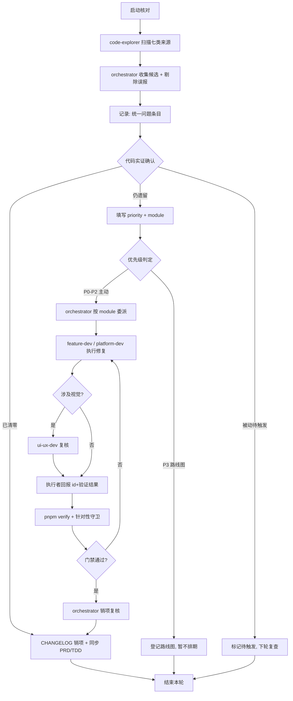

# 遗留问题处理流程设计（Legacy Issue Handling Workflow）

> 本文档定义本仓库遗留问题「核对 + 修复」两阶段处理流程，以及基于现有 12 个子代理的协作机制、职责边界、信息传递方式与关键节点检查清单。
>
> 定位：**方法论 + 流程框架**，可复用；本文档不硬编码长期漂移的数值/清单快照，具体遗留项的路径、依赖关系、阈值均以代码为唯一事实源。当前遗留问题清单仅作为附录 A 的快照示例（以代码实际状态为准）。

---

## §1 概述与适用范围

### 1.1 目的

- 将散落在 CHANGELOG、代码注释、文档待办、memory 记录中的「遗留/待办」事项，收敛为一套**可核对、可销项、可委派**的统一处理流程。
- 避免「遗留项只登记、无人核对、无法确认是否已清零」的漂移问题——每一项都必须经**代码实证**后才能标记为「已清零」或「仍遗留」。

### 1.2 两阶段总览

| 阶段 | 目标 | 输出 | 主导方 |
|---|---|---|---|
| **A. 问题核对** | 收集、记录、确认问题现状 | 问题清单（含证据与状态） | orchestrator + code-explorer |
| **B. 问题修复** | 评估、选择策略、执行、验证 | 代码/文档变更 + 销项记录 | 对应 feature-dev / platform-dev |

### 1.3 与三层文档的关系

| 文档 | 职责 | 遗留项联动规则 |
|---|---|---|
| `docs/PRD.md` | 产品规格（What/Why） | **功能缺口**类遗留 → 登记 PRD |
| `docs/TDD.md` | 技术设计（How） | **架构/数据模型**类遗留 → 登记 TDD |
| `docs/CHANGELOG.md` | 执行历史与版本演进 | **所有遗留项的登记入口与销项出口** |

> 规则：遗留项**登记**统一进 CHANGELOG（演进历史）；若其本质是功能缺口或架构变更，需在登记时**同步** PRD/TDD，避免三处各自维护漂移。销项时反向同步。

---

## §2 问题来源与分类标准

### 2.1 来源枚举（含扫描关键词与实测状态）

| # | 来源 | 扫描关键词 | 当前实测状态（2026-08-13） |
|---|---|---|---|
| S1 | CHANGELOG 遗留标记 | `遗留` `待启动` `路线图` `待消费` `暂不` `未迁移` `仍为骨架` `后续里程碑` `不覆盖` | **主来源**：17 处命中，其中 3 处仍遗留（见附录 A），其余已清零 |
| S2 | 代码 TODO/FIXME 注释 | `TODO` `FIXME` `HACK` `XXX` `待重构` | 0 处真实命中（仅 4 处「临时/XXX」属扑克语境的误报） |
| S3 | 测试 skip/todo | `it.skip` `describe.skip` `test.skip` `xit(` `xtest(` `.todo(` | 0 处 |
| S4 | TDD/PRD 待办 | `待` `后续` `TODO` | 以文档当前内容为准 |
| S5 | memory 记录 | `.codebuddy/memory/` 日档与 MEMORY.md | 以 memory 文件实际内容为准 |
| S6 | git 未跟踪临时文件 | `git status --porcelain` | 当前为空（工作树干净） |
| S7 | 子代理文件待办 | `.claude/agents/*.md` 中 `待办` `遗留` `待优化` | 0 处 |

> 结论：本仓库遗留线索**高度收敛于 CHANGELOG**，代码/测试/子代理文件当前均无遗留标记。因此核对流程以「CHANGELOG 登记项 + 代码实证复核」为绝对主线，其余来源作为补充巡检。

### 2.2 分类标准（四维）

每个遗留项在登记时必须标注以下四个维度：

**维度一 · 按性质**
- `技术债`：跨模块残留依赖、硬编码、重复实现等
- `功能缺口`：骨架未填充、变体未适配
- `文档漂移`：文档与代码事实不一致
- `守卫盲区`：测试/门禁无法兜底的边界（如 zh/en 双缺 key）
- `待消费契约`：字段/工具已存在但无消费方，等待未来使用

**维度二 · 按触发方式**
- `主动可推进`：可立即启动修复
- `被动触发`：需消费方/第三语言等前置条件出现才启动（登记为「待触发」而非「进行中」）

**维度三 · 按风险**
- `高`：涉及 persist version 变更 / 跨模块引用倒置 / 用户可见数据破坏
- `中`：局部逻辑调整，有守卫测试兜底
- `低`：纯文档/注释清理、命名规范

**维度四 · 按模块归属**
- `platform`（shared/路由/i18n 基础设施/persist 协调）
- `<feature>`（各 feature 模块，如 progress / strategy-academy / theory-academy）
- `ui-ux`（全局视觉/响应式/可访问性）

---

## §3 核对流程（A 阶段）

> 目标：把「登记在案的遗留项」与「代码现状」对齐，产出带证据的清单。核心原则：**没有代码实证，不得标记销项。**

### 3.1 收集（Collect）

1. 全量扫描 §2.1 七类来源（关键词搜索 + `git status --porcelain`）。
2. 对每个命中点读取上下文，剔除误报（如扑克语境的「临时/XXX」）。
3. 汇总为「候选遗留项」集合。

### 3.2 记录（Record）

每个候选项登记为统一字段的问题条目：

```text
id            : 唯一标识（如 LI-2026-08-13-01）
source        : S1~S7 来源编号
nature        : 技术债 / 功能缺口 / 文档漂移 / 守卫盲区 / 待消费契约
trigger       : 主动可推进 / 被动触发
risk          : 高 / 中 / 低
module        : platform / <feature> / ui-ux
evidence      : 命中文件路径 + 行号 + 摘要（代码实证证据）
status        : 待确认 / 仍遗留 / 已清零
priority      : P0-P3（确认后填写）
```

### 3.3 确认（Confirm）—— 代码实证

对每个「待确认」项执行实证复核，判定其**真实状态**：

- **消费方/依赖复核**：grep 该字段/该依赖是否仍存在消费方 → 判定「仍遗留」或「已清零」。
- **门禁复核**：跑 `pnpm verify` 确认是否存在守卫测试兜底。
- **判定规则**：
  - `仍遗留`：证据显示问题现状与登记一致，尚未修复。
  - `已清零`：证据显示问题已被后续批次解决（例：曾标记「lesson.title 硬编码」→ 后续 i18n 全量迁移已解决）。
  - `被动待触发`：前置条件（消费方/第三语言）未出现，登记为「待触发」，**不进入修复排期**。

### 3.4 销项（Close）

- 「已清零」项在 CHANGELOG 追加销项记录（`已清零：<id> <简述>`），并按 §1.3 反向同步 PRD/TDD。
- 「仍遗留」项进入 B 阶段排期。
- 「被动待触发」项保留在清单但标记 `待触发`，下次核对时优先复查前置条件是否已出现。

---

## §4 修复流程（B 阶段）

> 目标：对「仍遗留」且「主动可推进」的项，按优先级评估 → 策略选择 → 执行 → 验证闭环处理。

### 4.1 优先级评估（P0-P3）

复用 CHANGELOG 既有 P0-P3 分级语义，不另造体系：

| 级别 | 含义 | 判定依据 |
|---|---|---|
| **P0** | 阻断/破坏性 | 构建失败、数据破坏、用户可见错误 |
| **P1** | 高优先级 | 核心功能缺陷、跨模块引用违规 |
| **P2** | 中优先级 | 局部缺陷、守卫盲区、可复用的补漏 |
| **P3** | 低优先级/路线图 | 架构级重构（如依赖倒置）、需大范围协作 |

评估输入：`risk` 维度 × `影响面（模块数/用户可见性）` × `触发条件`。P3 类项进入路线图，不在单次修复中强行推进。

### 4.2 修复策略选择

| 策略 | 适用场景 | 典型动作 |
|---|---|---|
| **跨模块倒置重构** | 技术债 · 跨模块残留依赖（如 progress → strategy-academy） | 提取到 shared 层 / 事件总线解耦 / 白名单收敛 |
| **补漏** | 守卫盲区、i18n 双缺 key | 补守卫测试、补双语 key、强化断言 |
| **依赖引入评估** | 盲区需第三方工具（如 i18next-parser） | 评估 bundle 体积 → 决策引入或暂缓 |
| **被动等待** | 待消费契约（无消费方字段） | 标记 `待触发`，不排期 |
| **文档同步** | 文档漂移 | 修正 PRD/TDD/CHANGELOG 与代码对齐 |

### 4.3 修复执行

1. **委派**：按 `module` 归属委派对应子代理（见 §5.3 职责表）。
2. **代码修改**：子代理按「新增页面/组件标准路径」工作流执行（单文件 ≤300 行、双语同步、测试选对后缀）。
3. **文档同步**：涉及架构 → 同步 TDD；涉及功能 → 同步 PRD；均记录 CHANGELOG（`type(scope): description`）。
4. **提交**：逻辑单元独立提交，禁止多模块批量合入。

### 4.4 验证（Verify）

1. **门禁**：`pnpm verify`（= typecheck && lint && test）exit code 0。
2. **针对性守卫**：涉及 i18n → 跑 `localeParity.test.ts`；涉及跨模块 → 跑 eslint `no-restricted-imports`；涉及视觉 → `designTokenGuard.test.ts`。
3. **销项复核**：回到 §3.3 实证确认问题已消失，再在 CHANGELOG 销项。

---

## §5 子代理协作机制

### 5.1 划分方式

**复用现有 12 个子代理，不新增代理**。遗留项按 `module` 归属映射到对应代理；跨模块/基础设施类统一由 `platform-dev` 兼任 orchestrator（编排者）。

### 5.2 角色定义

| 角色 | 代理 | 在遗留处理中的职责 |
|---|---|---|
| **Orchestrator（编排者）** | `platform-dev` | 发起核对、汇总清单、优先级评估、委派、收口销项 |
| **Scanner（扫描者）** | `code-explorer`（builtin） | 执行 §3.1 全库扫描，产出候选遗留项 |
| **Executor（执行者）** | 对应 feature-dev | 执行代码修复，遵循模块工作流 |
| **Infra Executor** | `platform-dev` | shared 层/i18n/路由/persist 协调类修复 |
| **Design Reviewer** | `ui-ux-dev` | 涉及视觉/响应式/可访问性的修复复核 |

### 5.3 职责边界（Authority）

- **orchestrator（platform-dev）可决策**：优先级评定、委派、白名单收敛、persist 协调、i18n 基础设施、跨模块倒置的 shared 层安置。
- **orchestrator 不可越界**：不直接改 feature 模块内部业务逻辑（委派对应 feature-dev）；不绕过 ui-ux-dev 改全局设计语言。
- **feature-dev 可决策**：本模块内部逻辑修复。
- **feature-dev 不可越界**：不跨模块直接引用（遵守 `eslint.config.js` 的 `ALLOWED_CROSS_IMPORTS`）；不裸写 `localStorage`；不引入新依赖未经 platform-dev 评审。

> 完整 Authority 以各子代理文件（`.claude/agents/*.md`）与 `docs/agents-guide/子智能体文件标准化规范.md` 为唯一事实源。

### 5.4 协作机制与信息传递

- **共享契约 = 问题清单**：所有角色围绕同一份问题清单（§3.2 字段）读写，作为信息传递的唯一载体。
- **时序**：
  1. orchestrator 派发「核对任务」→ code-explorer 扫描 → 回传候选清单。
  2. orchestrator 实证确认 → 产出正式清单（含 priority）。
  3. orchestrator 按 module 委派 → executor 执行 → 回报「已完成 + 验证结果」。
  4. ui-ux-dev 对视觉类修复复核 → 回报复核结论。
  5. orchestrator 收口 → 复核销项 → 更新 CHANGELOG。
- **信息传递方式**：问题条目通过 `id` 关联贯穿全程；子代理回报须携带 `id + 验证命令 + 输出结论`，避免口头模糊交接。

---

## §6 整体流程图



### 步骤说明

1. **核对阶段（A）**：扫描 → 收集 → 记录 → 实证确认 → 分流（销项 / 遗留 / 待触发）。
2. **修复阶段（B）**：优先级判定 → 委派 → 执行（含 ui-ux 复核）→ 门禁验证 → 销项复核 → 闭环。
3. **衔接关键**：`问题清单` 是 A/B 两阶段的唯一衔接物；`id` 贯穿全程；销项必须回到实证确认。

---

## §7 关键节点检查清单

### A 阶段出口（核对）

- [ ] 七类来源已全量扫描，误报已剔除
- [ ] 每个候选项已登记为统一字段条目（id/source/nature/trigger/risk/module/evidence/status）
- [ ] 每个「已清零」判定均有 grep 实证证据（消费方/依赖已不存在）
- [ ] 「被动待触发」项已标注前置条件与下轮复查点
- [ ] 清单与 CHANGELOG 登记项一一对应，无遗漏

### B 阶段出口（修复）

- [ ] 优先级 P0-P3 已评定且理由可回溯
- [ ] 已按 module 委派正确代理，无越界修改
- [ ] `pnpm verify` exit code 0
- [ ] 针对性守卫已跑（i18n / 跨模块 eslint / 设计 token）
- [ ] 文档已同步（PRD/TDD/CHANGELOG 三层对齐）
- [ ] 提交粒度合规（逻辑单元独立，`type(scope): description`）
- [ ] 销项已回实证确认，问题条目状态更新为「已清零」

---

## 附录 A：当前遗留问题清单（快照，以代码为唯一事实源）

> 本清单为 2026-08-13 核对快照，数值/路径/依赖以代码实际状态为准，本文档不维护长期快照。

### A.1 仍遗留（待处理）

| id | 性质 | 触发 | 风险 | 模块 | 摘要 | 优先级 |
|---|---|---|---|---|---|---|
| LI-1 | 技术债 | 主动可推进 | 高 | progress | `dailyTrainingPlan` / `ProgressReplay` 仍直接 import strategy-academy，跨模块依赖待倒置；`ALLOWED_CROSS_IMPORTS` 中 progress 边已收敛为 `['strategy-academy']` | P3 |
| LI-2 | 守卫盲区 | 主动可推进（需评估依赖） | 中 | i18n | `localeParity.test.ts` 只兜底单边缺失，「zh/en 双缺 key」属盲区；待评估引入 i18next-parser | P2 |
| LI-3 | 待消费契约 | 被动触发 | 低 | shared | `handRankingChanges`（`shared/types/poker.ts` + `shared/constants/poker.ts`）无消费方，待消费方出现时 key 化 | P3（待触发） |

### A.2 曾标记遗留、已清零（核对闭环示例）

- strategy-academy 数据层 `lesson.title` 中文硬编码 → 由渲染层 i18n 化 + 课程内容全量迁移解决
- 课程正文内容硬编码 / 变体 title 元数据未迁移 → 由内容全量 i18n 迁移解决
- StreakCelebration rgba 光晕 / 历史组件内联 transition → 已 token 化
- `quizShuffle.test.ts #4` 原有测试 bug → 已修复
- TD-001 lessonId 命名空间治理（待启动）→ 由 P2-04 lessonId 重复治理解决
- 08-07 Next Steps 五个 checkbox（短牌/单挑 T4-T9、L3-L8 内容、Quiz 变体适配）→ 由后续内容补全批次完成
- T4-T9 骨架 → 已填充

> 这些条目证明了「登记 → 后续批次解决 → 销项」闭环的可行性，也说明**未销项的登记容易沉淀为长期漂移**，故本文档以「代码实证销项」为硬约束。

---

**维护说明**：本文档属流程类文档，与 `docs/knowledge-guide.md` / `docs/AI_GUIDE.md` 并列。流程本身的演进记录于 `docs/CHANGELOG.md`；附录 A 快照更新频率以每次核对为准，不作为长期事实源。
